# Coupon System Refactor Documentation

> **Version:** 1.0.0  
> **Last Updated:** 2026-07-12  
> **Audience:** Backend Developers, Frontend Developers, QA Engineers, Future Maintainers

---

## Table of Contents

1. [Overview](#1-overview)
2. [Old Architecture](#2-old-architecture)
3. [New Architecture](#3-new-architecture)
4. [Complete Flow Diagrams](#4-complete-flow-diagrams)
5. [Business Rules](#5-business-rules)
6. [Backend API Documentation](#6-backend-api-documentation)
7. [Frontend Integration Guide](#7-frontend-integration-guide)
8. [API Response Changes](#8-api-response-changes)
9. [Database Changes](#9-database-changes)
10. [Validation Pipeline](#10-validation-pipeline)
11. [Calculation Pipeline](#11-calculation-pipeline)
12. [Removed Technical Debt](#12-removed-technical-debt)
13. [Performance](#13-performance)
14. [Error Handling](#14-error-handling)
15. [Testing](#15-testing)
16. [Production Readiness Checklist](#16-production-readiness-checklist)
17. [Complete Sequence Diagrams](#17-complete-sequence-diagrams)
18. [Frontend Developer Cheat Sheet](#18-frontend-developer-cheat-sheet)
19. [Backend Developer Cheat Sheet](#19-backend-developer-cheat-sheet)
20. [Appendix: File Manifest](#20-appendix-file-manifest)

---

## 1. Overview

### Why the Coupon System Was Refactored

The original coupon system had organically grown over multiple iterations, accumulating significant technical debt. Business logic was scattered across the codebase — validation existed in the Coupon model, calculation existed in the Coupon model and a separate OrderRepository, and both CouponService and CouponRepository contained partially overlapping logic.

### Problems in the Old Implementation

| Problem | Description | Impact |
|---|---|---|
| Duplicated validation logic | `Coupon::isValid()` existed on the model, while `CouponService::addCouponToCart()` had inline validation | Bugs from inconsistent checks |
| Duplicated calculation logic | `Coupon::calcPrice()` + `OrderRepository::recordCouponUsage()` both calculated discounts independently | Inconsistent pricing |
| Mixed responsibilities | The Coupon Model handled DB scopes, validation, calculation, and display logic | Violated Single Responsibility Principle |
| No standardized error response | Each caller returned different error structures | Frontend had to parse multiple formats |
| No product restriction checks | The old system never validated whether a coupon's product restrictions matched the cart contents | Coupons could be applied to ineligible carts |
| No undo protection for usage tracking | The old `recordCouponUsage()` used plain `create()` allowing duplicate records | Double-counted coupon usage |
| Checkout revalidation missing | Once a coupon was applied, it was never re-validated at checkout time | Expired/disabled coupons could be consumed at checkout |

### Goals of the New Architecture

1. **Single Responsibility Principle** — Each class does exactly one thing.
2. **DRY (Don't Repeat Yourself)** — One validation pipeline, one calculation pipeline.
3. **Standardized Error Handling** — Every validation failure returns a consistent structure with `reason` and `message`.
4. **Two-Phase Validation** — Validate at apply-time AND re-validate at checkout-time.
5. **Immutable Usage History** — Use `firstOrCreate()` to prevent duplicate coupon usage records.
6. **Product Restriction Support** — Validate that cart items match coupon product restrictions.
7. **Full Test Coverage** — Unit tests for validation and calculation + feature tests for full HTTP flows.

### Business Rules Implemented

| Rule | Description |
|---|---|
| One coupon per cart | A cart can have at most one coupon applied at any time |
| One coupon per user lifetime | A coupon cannot be used more than once by the same user |
| Replace on different coupon | Applying a different coupon replaces the existing one |
| Already-applied detection | Re-applying the same coupon returns a distinct response |
| Product restriction | Coupon only applies if cart contains at least one product the coupon targets |
| Checkout revalidation | Coupon is re-validated during order creation; silently removed if invalid |
| Usage limiter | Coupon has a maximum number of uses across all users; checked at apply time |
| Date validity | Coupon must be within start_date and end_date range |
| Status check | Coupon must have `status = true` |
| Payment consumption | Coupon usage is recorded only after payment succeeds (COD mark-paid or status-change to completed) |
| Auto-removal on empty cart | When the last item is removed from cart, the coupon is automatically cleared |
| Zero floor on pricing | No discount can make a price negative; minimum is 0.00 |

---

## 2. Old Architecture

### Previous Implementation

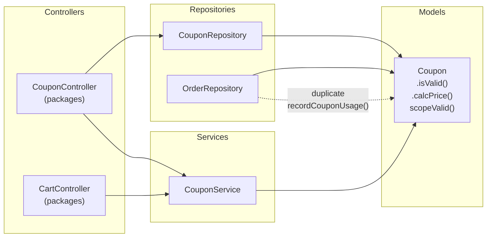
```mermaid
flowchart LR
    subgraph Controllers
        CouponCtrl["CouponController\n(packages)"]
        CartCtrl["CartController\n(packages)"]
    end

    subgraph Services
        CouponSvc["CouponService"]
    end

    subgraph Repositories
        CouponRepo["CouponRepository"]
        OrderRepo["OrderRepository"]
    end

    subgraph Models
        CouponModel["Coupon\n.isValid()\n.calcPrice()\nscopeValid()"]
    end

    CouponCtrl --> CouponRepo
    CouponCtrl --> CouponSvc
    CartCtrl --> CouponSvc
    CouponSvc --> CouponModel
    CouponRepo --> CouponModel
    OrderRepo --> CouponModel
    OrderRepo -.->|"duplicate\nrecordCouponUsage()"| CouponModel
```

### Where Validation Existed

**1. Coupon Model `isValid()` (deprecated)**

```php
// packages/marvel/src/Database/Models/Coupon.php:108
public function isValid(): bool
{
    return $this->status
        && (!$this->start_date || $this->start_date->lte($today))
        && (!$this->end_date || $this->end_date->gte($today))
        && (is_null($this->limiter) || $this->used < $this->limiter);
}
```

Only checked status, dates, and limiter. Did NOT check:
- Product restrictions
- Already-used-by-user
- Returned no reason for failure

**2. CouponService `addCouponToCart()` (old)**

Had inline validation that partially overlapped with `isValid()`. Checked whether the coupon was already applied but used separate logic.

**3. CouponRepository (old)**

Had its own `verifyCoupon()` method (now commented out) that performed date checks independently.

### Where Calculation Existed

**1. Coupon Model `calcPrice()` (deprecated)**

```php
// packages/marvel/src/Database/Models/Coupon.php:188
public function calcPrice($price): ?float
```

Returned only the final price (a float). No metadata about the discount breakdown.

**2. OrderRepository `recordCouponUsage()` (packages)**

```php
// packages/marvel/src/Database/Repositories/OrderRepository.php:408
protected function recordCouponUsage(int $couponId, int $orderId, ?int $userId): void
{
    CouponUsage::create([...]);
}
```

Used `create()` directly — could create duplicate records if called multiple times. Did not guard against duplicates.

### All Duplicated Logic

| Logic | Where | Duplicated In |
|---|---|---|
| Status + date validation | `Coupon::isValid()` | `CouponRepository::verifyCoupon()` |
| Usage tracking | `OrderRepository::recordCouponUsage()` | `OrderService::recordCouponUsage()` |
| Price calculation | `Coupon::calcPrice()` | `ProductPricingService::calculateCouponPrice()` |
| Coupon-to-cart assignment | `CouponService::addCouponToCart()` | `CouponRepository::addCouponToCart()` |

### Every Issue

1. **`isValid()` never checked product restrictions** — A coupon restricted to specific products could be applied to a cart containing none of them.
2. **`isValid()` never checked user history** — A user could re-apply the same coupon on multiple orders.
3. **`isValid()` returned only a boolean** — No reason for failure, so frontend could only show a generic "invalid coupon" message.
4. **`calcPrice()` returned only a float** — No discount breakdown, so frontend couldn't display the discount amount separately.
5. **No checkout revalidation** — A coupon valid when applied could expire before checkout completed.
6. **Duplicate usage records possible** — `create()` without `firstOrCreate()` allowed the same coupon_id + user_id to be recorded multiple times.
7. **Two code paths for coupon usage** — `OrderRepository::recordCouponUsage()` and `OrderService::recordCouponUsage()` had different idempotency behavior (`create` vs `firstOrCreate`).

---

## 3. New Architecture

### Architecture Diagram

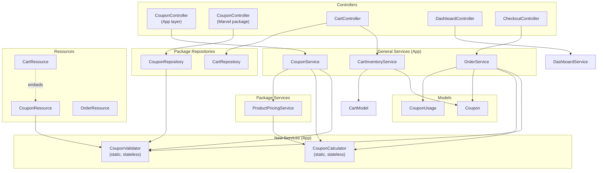
```mermaid
flowchart TB
    subgraph Controllers
        AppCouponCtrl["CouponController\n(App layer)"]
        MarvelCouponCtrl["CouponController\n(Marvel package)"]
        CartCtrl["CartController"]
        DashboardCtrl["DashboardController"]
        CheckoutCtrl["CheckoutController"]
    end

    subgraph "New Services (App)"
        CouponValidator["CouponValidator\n(static, stateless)"]
        CouponCalculator["CouponCalculator\n(static, stateless)"]
    end

    subgraph "General Services (App)"
        CouponSvc["CouponService"]
        OrderSvc["OrderService"]
        CartInventorySvc["CartInventoryService"]
    end

    subgraph "Package Repositories"
        CouponRepo["CouponRepository"]
        CartRepo["CartRepository"]
    end

    subgraph "Package Services"
        PricingSvc["ProductPricingService"]
    end

    subgraph Resources
        CouponRes["CouponResource"]
        CartRes["CartResource"]
        OrderRes["OrderResource"]
    end

    subgraph Models
        CouponModel["Coupon"]
        CouponUsage["CouponUsage"]
    end

    AppCouponCtrl --> CouponSvc
    MarvelCouponCtrl --> CouponRepo
    CartCtrl --> CartInventorySvc
    CartCtrl --> CartRepo
    CheckoutCtrl --> OrderSvc
    DashboardCtrl --> DashboardService

    CouponSvc --> CouponValidator
    CouponSvc --> CouponCalculator
    CouponSvc --> PricingSvc

    CouponRepo --> CouponValidator

    OrderSvc --> CouponValidator
    OrderSvc --> CouponCalculator
    OrderSvc --> CouponModel
    OrderSvc --> CouponUsage

    CartInventorySvc --> CouponModel
    CartInventorySvc --> CartModel

    PricingSvc --> CouponCalculator

    CouponRes --> CouponValidator
    CartRes -.->|"embeds"| CouponRes
```

### Responsibilities

#### `App\Services\Coupon\CouponValidator`
- **Single responsibility:** Validate whether a coupon can be used.
- **Static methods:** `validate(Coupon, ?User, ?Collection)` and `validateByCode(string, ?User, ?Collection)`
- **Returns structured array:** `{ valid: bool, reason: string|null, message: string|null, coupon: Coupon|null }`
- **Stateless:** No constructor dependencies. Pure function on given inputs.
- **File:** `app/Services/Coupon/CouponValidator.php`

#### `App\Services\Coupon\CouponCalculator`
- **Single responsibility:** Calculate the discount amount and final price.
- **Static method:** `calculate(Coupon, float price)`
- **Returns structured array:** `{ discountAmount: float, finalPrice: float, discountType: string, freeShipping: bool }`
- **Stateless:** Pure function. No database queries.
- **File:** `app/Services/Coupon/CouponCalculator.php`

#### `App\Services\General\CouponService`
- **Responsibilities:**
  - Listing coupons (`getCoupons()`)
  - Price calculation delegation (`calcPrice()`, `calcPriceByCode()`)
  - Finding coupons by code (`findByCode()`)
  - Applying coupon to cart with validation (`addCouponToCart()`)
- **Does NOT validate inline** — delegates to `CouponValidator`.
- **Does NOT calculate inline** — delegates to `CouponCalculator`.
- **File:** `app/Services/General/CouponService.php`

#### `Marvel\Database\Repositories\CouponRepository`
- **Responsibilities:**
  - CRUD operations for coupons (`storeCoupon`, `updateCoupon`)
  - Applying coupon to cart (`addCouponToCart()`) — the package-level entry point
- **Validation:** Now delegates to `CouponValidator::validateByCode()` instead of inline checks.
- **File:** `packages/marvel/src/Database/Repositories/CouponRepository.php`

#### `App\Services\General\OrderService`
- **Responsibilities:**
  - Checkout order creation (`addItemsInOrder()`)
  - Invoice calculation (`calcInvoicePrice()`)
  - Cart management (`clearCart()`)
  - Payment flows (`markCodAsPaid()`, `markCashierPaid()`)
  - Order status changes (`changeOrderStatus()`)
  - Coupon usage recording (`recordCouponUsage()`) — private method
- **Revalidation:** On checkout, re-validates cart coupon via `CouponValidator::validateByCode()`.
- **Usage recording:** Uses `firstOrCreate()` with composite key `[coupon_id, user_id]` — never creates duplicates.
- **File:** `app/Services/General/OrderService.php`

#### `Marvel\Database\Models\Coupon`
- **Responsibilities:**
  - Database schema mapping (fillable, casts, table)
  - Relationships (`products()`, `orders()`, `users()`, `couponUsages()`)
  - Query scopes (`scopeValid`, `scopeInvalid`, `scopeSearch`)
  - Auto-generation of `code` on create (boot `creating` event)
- **Deprecated methods retained for backward compatibility:** `isValid()`, `calcPrice()`
- **No business logic in the model** — validation and calculation are delegated to dedicated service classes.
- **File:** `packages/marvel/src/Database/Models/Coupon.php`

#### `Marvel\Http\Resources\CouponResource`
- **Responsibilities:** Transform coupon model to API response.
- **Validation in resource:** Uses `CouponValidator::validate($this)['valid']` to populate `is_valid` field.
- **File:** `packages/marvel/src/Http/Resources/CouponResource.php`

#### `Marvel\Http\Resources\CartResource`
- **Responsibilities:** Transform cart model to API response.
- **Coupon in cart:** Returns both `coupon` (full coupon object via `CouponResource`) and `coupon_code` (string for backward compatibility).
- **File:** `packages/marvel/src/Http/Resources/CartResource.php`

#### `App\Http\Resources\Order\OrderResource`
- **Responsibilities:** Transform order model to API response.
- **Coupon in order:** Returns `coupon` (code string), `coupon_discount`, `coupon_discount_type`, `promotion_discount`.
- **File:** `app/Http/Resources/Order/OrderResource.php`

#### `Marvel\Services\Pricing\ProductPricingService`
- **Responsibilities:** Product-level pricing including discounts, flash sales.
- **Coupon calculation:** `calculateCouponPrice()` and `calculateCouponPriceByCode()` both delegate to `CouponCalculator::calculate()`.
- **File:** `packages/marvel/src/Services/Pricing/ProductPricingService.php`

#### `App\Services\General\CartInventoryService`
- **Responsibilities:** Cart item reservation, release, finalization.
- **Auto-coupon removal:** When the last item is removed (`releaseCart()` or `releaseItem()` with remaining === 0), the coupon field is set to `null`.
- **File:** `app/Services/General/CartInventoryService.php`

### How Responsibilities Changed

| Component | Before | After |
|---|---|---|
| **Coupon Model** | Validation + Calculation + Scopes + Relationships | Scopes + Relationships only |
| **CouponValidator** | Did not exist | All validation logic |
| **CouponCalculator** | Did not exist | All calculation logic |
| **CouponService** | Mixed validation + DB queries | Orchestration + delegation |
| **CouponRepository** | Mixed validation + CRUD | CRUD + delegation to Validator |
| **OrderService** | Re-invented usage tracking | Delegation + `firstOrCreate()` |
| **OrderRepository (packages)** | Duplicate `recordCouponUsage()` | Retained but separate |
| **CouponResource** | Used deprecated `isValid()` | Uses `CouponValidator::validate()` |
| **CartResource** | No coupon object | Full coupon object via CouponResource |

---

## 4. Complete Flow Diagrams

### Apply Coupon

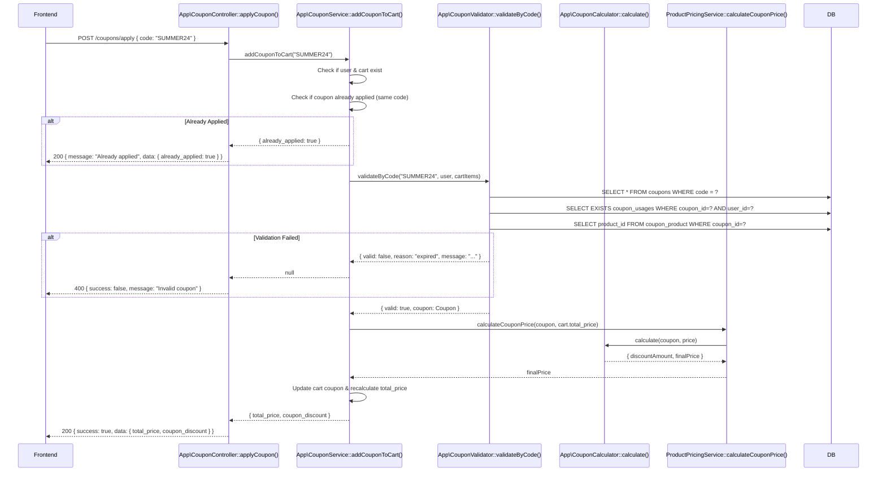
```mermaid
sequenceDiagram
    participant Frontend
    participant AppCouponCtrl as App\CouponController::applyCoupon()
    participant CouponSvc as App\CouponService::addCouponToCart()
    participant Validator as App\CouponValidator::validateByCode()
    participant Calculator as App\CouponCalculator::calculate()
    participant ProductPricing as ProductPricingService::calculateCouponPrice()
    participant DB

    Frontend->>AppCouponCtrl: POST /coupons/apply { code: "SUMMER24" }
    AppCouponCtrl->>CouponSvc: addCouponToCart("SUMMER24")

    CouponSvc->>CouponSvc: Check if user & cart exist
    CouponSvc->>CouponSvc: Check if coupon already applied (same code)
    alt Already Applied
        CouponSvc-->>AppCouponCtrl: { already_applied: true }
        AppCouponCtrl-->>Frontend: 200 { message: "Already applied", data: { already_applied: true } }
    end

    CouponSvc->>Validator: validateByCode("SUMMER24", user, cartItems)
    Validator->>DB: SELECT * FROM coupons WHERE code = ?
    Validator->>DB: SELECT EXISTS coupon_usages WHERE coupon_id=? AND user_id=?
    Validator->>DB: SELECT product_id FROM coupon_product WHERE coupon_id=?

    alt Validation Failed
        Validator-->>CouponSvc: { valid: false, reason: "expired", message: "..." }
        CouponSvc-->>AppCouponCtrl: null
        AppCouponCtrl-->>Frontend: 400 { success: false, message: "Invalid coupon" }
    end

    Validator-->>CouponSvc: { valid: true, coupon: Coupon }
    CouponSvc->>ProductPricing: calculateCouponPrice(coupon, cart.total_price)
    ProductPricing->>Calculator: calculate(coupon, price)
    Calculator-->>ProductPricing: { discountAmount, finalPrice }
    ProductPricing-->>CouponSvc: finalPrice
    CouponSvc->>CouponSvc: Update cart coupon & recalculate total_price
    CouponSvc-->>AppCouponCtrl: { total_price, coupon_discount }
    AppCouponCtrl-->>Frontend: 200 { success: true, data: { total_price, coupon_discount } }
```

### Checkout Flow

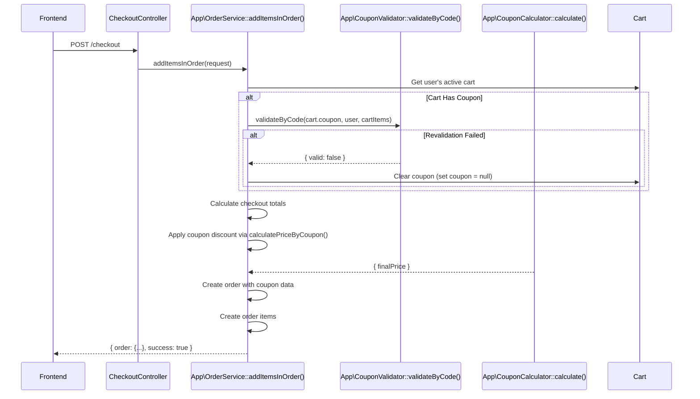
```mermaid
sequenceDiagram
    participant Frontend
    participant CheckoutCtrl as CheckoutController
    participant OrderSvc as App\OrderService::addItemsInOrder()
    participant Validator as App\CouponValidator::validateByCode()
    participant Calculator as App\CouponCalculator::calculate()
    participant Cart

    Frontend->>CheckoutCtrl: POST /checkout
    CheckoutCtrl->>OrderSvc: addItemsInOrder(request)

    OrderSvc->>Cart: Get user's active cart

    alt Cart Has Coupon
        OrderSvc->>Validator: validateByCode(cart.coupon, user, cartItems)
        alt Revalidation Failed
            Validator-->>OrderSvc: { valid: false }
            OrderSvc->>Cart: Clear coupon (set coupon = null)
        end
    end

    OrderSvc->>OrderSvc: Calculate checkout totals
    OrderSvc->>OrderSvc: Apply coupon discount via calculatePriceByCoupon()
    Calculator-->>OrderSvc: { finalPrice }

    OrderSvc->>OrderSvc: Create order with coupon data
    OrderSvc->>OrderSvc: Create order items
    OrderSvc-->>Frontend: { order: {...}, success: true }
```

### Payment Success Flow

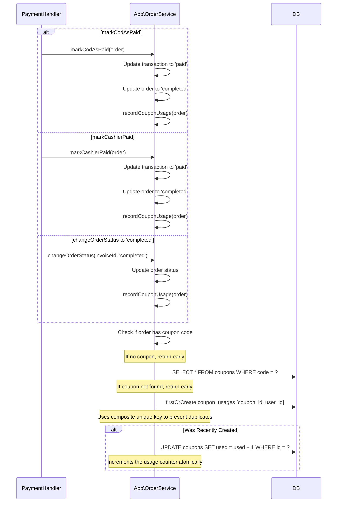
```mermaid
sequenceDiagram
    participant PaymentHandler
    participant OrderSvc as App\OrderService
    participant DB

    alt markCodAsPaid
        PaymentHandler->>OrderSvc: markCodAsPaid(order)
        OrderSvc->>OrderSvc: Update transaction to 'paid'
        OrderSvc->>OrderSvc: Update order to 'completed'
        OrderSvc->>OrderSvc: recordCouponUsage(order)
    else markCashierPaid
        PaymentHandler->>OrderSvc: markCashierPaid(order)
        OrderSvc->>OrderSvc: Update transaction to 'paid'
        OrderSvc->>OrderSvc: Update order to 'completed'
        OrderSvc->>OrderSvc: recordCouponUsage(order)
    else changeOrderStatus to 'completed'
        PaymentHandler->>OrderSvc: changeOrderStatus(invoiceId, 'completed')
        OrderSvc->>OrderSvc: Update order status
        OrderSvc->>OrderSvc: recordCouponUsage(order)
    end

    OrderSvc->>OrderSvc: Check if order has coupon code
    Note over OrderSvc: If no coupon, return early

    OrderSvc->>DB: SELECT * FROM coupons WHERE code = ?
    Note over OrderSvc: If coupon not found, return early

    OrderSvc->>DB: firstOrCreate coupon_usages [coupon_id, user_id]
    Note over OrderSvc: Uses composite unique key to prevent duplicates

    alt Was Recently Created
        OrderSvc->>DB: UPDATE coupons SET used = used + 1 WHERE id = ?
        Note over OrderSvc: Increments the usage counter atomically
    end
```

**Why `firstOrCreate()` is used:**

The composite key `[coupon_id, user_id]` enforces that a specific user can only have one usage record per coupon. This is the business rule: one coupon per user lifetime. If the same user checks out the same coupon multiple times (e.g., they applied it, payment failed, they re-applied), the second call to `recordCouponUsage()` will find the existing record and skip it, preventing a duplicate `increment('used')`.

**Why `updateOrCreate()` was removed:**

The original implementation in some versions used `updateOrCreate()` which would update the `order_id` and `used_at` on the existing record every time. This was semantically wrong — the original usage record should remain immutable. The current behavior is:
- First usage: create record + increment `used`
- Subsequent usages: no-op (record exists, `wasRecentlyCreated` is false)

### Cart Delete Flow

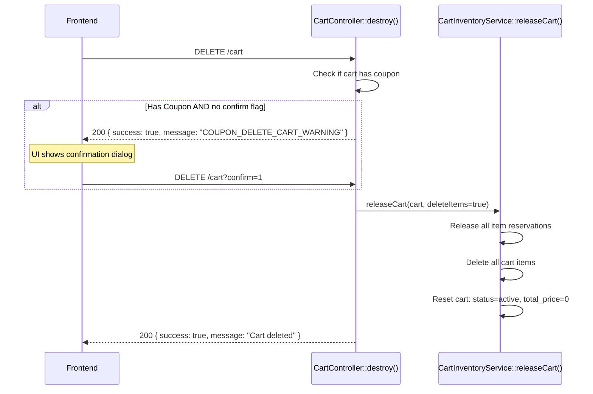
```mermaid
sequenceDiagram
    participant Frontend
    participant CartCtrl as CartController::destroy()
    participant InventorySvc as CartInventoryService::releaseCart()

    Frontend->>CartCtrl: DELETE /cart
    CartCtrl->>CartCtrl: Check if cart has coupon

    alt Has Coupon AND no confirm flag
        CartCtrl-->>Frontend: 200 { success: true, message: "COUPON_DELETE_CART_WARNING" }
        Note over Frontend: UI shows confirmation dialog
        Frontend->>CartCtrl: DELETE /cart?confirm=1
    end

    CartCtrl->>InventorySvc: releaseCart(cart, deleteItems=true)
    InventorySvc->>InventorySvc: Release all item reservations
    InventorySvc->>InventorySvc: Delete all cart items
    InventorySvc->>InventorySvc: Reset cart: status=active, total_price=0

    CartCtrl-->>Frontend: 200 { success: true, message: "Cart deleted" }
```

### Remove Last Item Flow

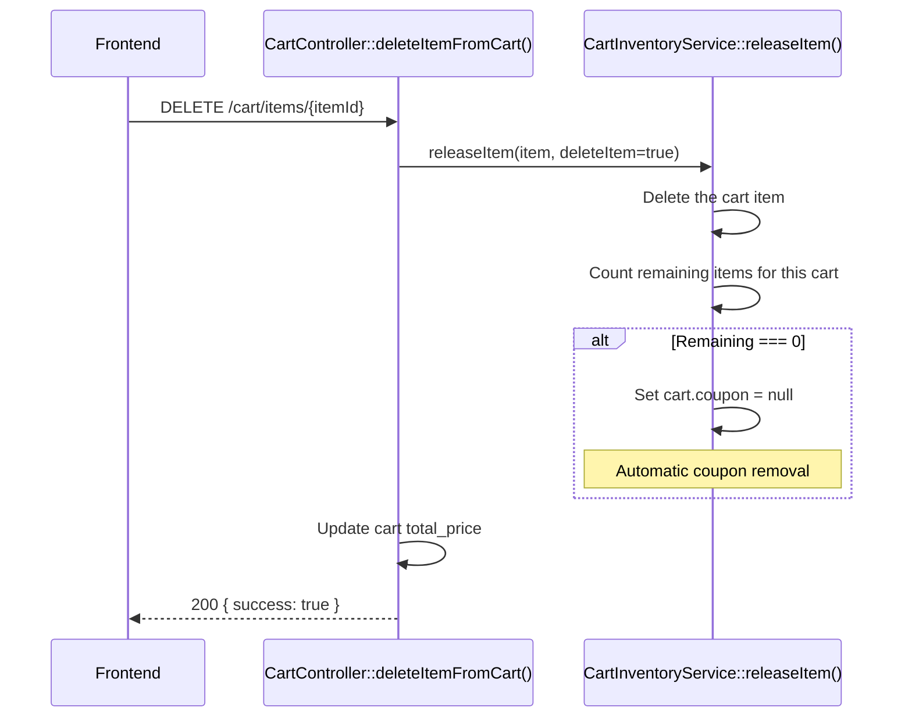
```mermaid
sequenceDiagram
    participant Frontend
    participant CartCtrl as CartController::deleteItemFromCart()
    participant InventorySvc as CartInventoryService::releaseItem()

    Frontend->>CartCtrl: DELETE /cart/items/{itemId}
    CartCtrl->>InventorySvc: releaseItem(item, deleteItem=true)

    InventorySvc->>InventorySvc: Delete the cart item
    InventorySvc->>InventorySvc: Count remaining items for this cart

    alt Remaining === 0
        InventorySvc->>InventorySvc: Set cart.coupon = null
        Note over InventorySvc: Automatic coupon removal
    end

    CartCtrl->>CartCtrl: Update cart total_price
    CartCtrl-->>Frontend: 200 { success: true }
```

---

## 5. Business Rules

| # | Rule | Description | Trigger | Implemented In |
|---|---|---|---|---|
| 1 | **One coupon per cart** | A cart can have at most one coupon code applied. | Apply coupon | `CouponService::addCouponToCart()` |
| 2 | **Replace on different code** | Applying a different coupon replaces the existing one silently. | Apply coupon with different code | `CouponService::addCouponToCart()`, `CouponRepository::addCouponToCart()` |
| 3 | **Already-applied detection** | Re-applying the same coupon returns `{ already_applied: true }` — not an error. | Apply coupon with same code | `CouponService::addCouponToCart()` |
| 4 | **One coupon per user per lifetime** | A coupon can only be consumed once by the same user. | `recordCouponUsage()` with `firstOrCreate()` | `OrderService::recordCouponUsage()` |
| 5 | **Product restriction** | Coupon only applies if cart contains at least one product in the coupon's `coupon_product` pivot. | Apply coupon, checkout revalidation | `CouponValidator::validate()` |
| 6 | **Checkout revalidation** | Coupon is re-validated during order creation. If invalid, silently removed from cart. | Checkout `addItemsInOrder()` | `OrderService::addItemsInOrder()` |
| 7 | **Usage limiter** | Coupon can only be used N times total (across all users). Checked at apply time. | Apply coupon | `CouponValidator::validate()` |
| 8 | **Date validity** | Coupon must be within `[start_date, end_date]` range (inclusive). | Apply coupon, checkout revalidation, resource display | `CouponValidator::validate()`, `Coupon::scopeValid()` |
| 9 | **Status check** | Coupon must have `status = true`. | Apply coupon, checkout revalidation, resource display | `CouponValidator::validate()`, `Coupon::scopeValid()` |
| 10 | **Payment consumption** | Coupon usage is recorded only when payment succeeds (order becomes completed). | `markCodAsPaid`, `markCashierPaid`, `changeOrderStatus` → `completed` | `OrderService::recordCouponUsage()` |
| 11 | **Auto-remove on empty cart** | When last item is deleted, coupon is cleared automatically. | Delete last cart item | `CartInventoryService::releaseItem()` |
| 12 | **Warning before cart delete** | If cart has coupon and no `confirm` flag, returns warning instead of deleting. | Delete cart | `CartController::destroy()` |
| 13 | **Zero floor** | No discount calculation can produce a negative price. Minimum is 0.00. | All price calculations | `CouponCalculator::calculate()` |
| 14 | **Disabled coupon** | Coupon with `status = false` cannot be applied. | Apply coupon | `CouponValidator::validate()` |
| 15 | **Expired coupon** | Coupon past `end_date` cannot be applied. | Apply coupon | `CouponValidator::validate()` |
| 16 | **Future coupon** | Coupon before `start_date` cannot be applied yet. | Apply coupon | `CouponValidator::validate()` |
| 17 | **Not found** | Invalid coupon code returns a distinct error. | Apply coupon | `CouponValidator::validateByCode()` |
| 18 | **Empty cart prevention** | Coupon cannot be applied to a cart with no items. | Apply coupon | `CouponRepository::addCouponToCart()` |

---

## 6. Backend API Documentation

### POST /api/v1/general/coupons/apply

Apply a coupon code to the authenticated user's active cart.

**Authentication:** Required (Sanctum)  
**Rate Limit:** `throttle:cart`

#### Request

```json
// Headers
Authorization: Bearer <sanctum_token>
Accept: application/json

// Body
{
    "code": "SUMMER24"
}
```

#### Success Response — Coupon Applied

```json
{
    "success": true,
    "message": "Coupon applied successfully",
    "data": {
        "total_price": 90.00,
        "coupon_discount": 10.00
    }
}
```

#### Success Response — Already Applied (Same Code)

```json
{
    "success": true,
    "message": "Coupon already applied",
    "data": {
        "already_applied": true
    }
}
```

#### Error Response — Invalid Coupon

```json
{
    "success": false,
    "message": "Invalid coupon code or coupon cannot be applied or coupon usage limit reached",
    "errors": {}
}
```

**HTTP Status Codes:**

| Code | Meaning |
|---|---|
| 200 | Coupon applied / Already applied |
| 400 | Invalid / Expired / Disabled / Limit reached / Product not eligible |
| 401 | Unauthenticated |
| 429 | Rate limited |

---

### DELETE /api/v1/cart

Delete the authenticated user's active cart.

**Authentication:** Required (Sanctum)  
**Rate Limit:** `throttle:cart`

#### Request

```json
// Headers
Authorization: Bearer <sanctum_token>
Accept: application/json

// Query Parameters (optional)
?confirm=1   // If cart has a coupon, confirm=1 bypasses the warning
```

#### Success Response — Warning (Coupon Present)

```json
{
    "success": true,
    "message": "This cart has a coupon, do you want to delete it anyway?",
    "data": []
}
```

#### Success Response — Deleted

```json
{
    "success": true,
    "message": "Cart deleted successfully",
    "data": []
}
```

**HTTP Status Codes:**

| Code | Meaning |
|---|---|
| 200 | Cart deleted / Warning shown |
| 400 | Unauthorized access to cart |
| 401 | Unauthenticated |

---

### DELETE /api/v1/cart/{itemId}

Delete a specific item from the cart. If this is the last item, the coupon is automatically cleared.

**Authentication:** Required (Sanctum)  
**Rate Limit:** `throttle:cart`

#### Request

```json
// Headers
Authorization: Bearer <sanctum_token>
Accept: application/json
```

#### Success Response

```json
{
    "success": true,
    "message": "Cart item deleted successfully",
    "data": []
}
```

**HTTP Status Codes:**

| Code | Meaning |
|---|---|
| 200 | Item deleted |
| 400 | Item not found / Not authorized |
| 401 | Unauthenticated |

---

### POST /api/v1/general/checkout

Create an order from the authenticated user's active cart. Auto-revalidates coupon.

**Authentication:** Required (Sanctum)  
**Rate Limit:** `throttle:api`

#### Request

```json
{
    "name": "John Doe",
    "user_phone": "+1234567890",
    "user_email": "john@example.com",
    "address": {"street": "123 Main St"},
    "fulfillment_type": "delivery",
    "payment_method": "cod",
    "governorate_id": 1
}
```

#### Success Response

```json
{
    "success": true,
    "message": "Order created successfully",
    "data": {
        "id": 42,
        "coupon": "SUMMER24",
        "coupon_discount": 10.00,
        "coupon_discount_type": "fixed_rate",
        "total": 145.00,
        "status": "pending",
        ...
    }
}
```

**Important:** If the coupon is invalid at checkout time (expired, limit reached, etc.), it is silently removed from the cart and the order is placed without the coupon. No error is returned — the order is created with the original price.

---

### GET /api/v1/dashboard/coupons

Retrieve coupon analytics for the admin dashboard. Requires super admin permissions.

**Authentication:** Required (Sanctum with super_admin role)

#### Success Response

```json
{
    "success": true,
    "message": "Coupon analytics fetched successfully",
    "data": {
        "total_usage": 15,
        "top_coupons": [
            {"id": 1, "code": "coupon_A1B2C3D", "name": "Summer Sale", "usage_count": 10}
        ],
        "revenue_by_coupon": [
            {"code": "coupon_A1B2C3D", "revenue": 1500.00}
        ],
        "total_coupon_discount": 250.00
    }
}
```

---

### GET /api/v1/coupons

List all coupons (paginated). Requires appropriate permissions.

**Authentication:** Required (Sanctum with view_coupons permission)

#### Query Parameters

| Parameter | Type | Description |
|---|---|---|
| `limit` | integer | Items per page (default: 15) |
| `active` | boolean | Filter to valid coupons only |
| `inactive` | boolean | Filter to invalid coupons only |
| `search` | string | Search by name or code |
| `order` | string | Column to order by |
| `sortedBy` | string | `asc` or `desc` |

#### Success Response

```json
{
    "success": true,
    "message": "Data fetched successfully",
    "data": [
        {
            "id": 1,
            "code": "coupon_A1B2C3D",
            "name": "Summer Sale",
            "image": {"desktop": null, "mobile": null},
            "borderColor": null,
            "borderless": false,
            "discount": 10.00,
            "discount_type": "Fixed discount",
            "max_discount_amount": null,
            "start_date": "2026-01-01",
            "end_date": "2026-12-31",
            "limiter": 100,
            "used": 15,
            "status": true,
            "is_valid": true,
            "created_at": "2026-01-01T00:00:00+00:00"
        }
    ]
}
```

---

## 7. Frontend Integration Guide

### When to Call Apply Coupon

The frontend should call `POST /api/v1/coupons/apply` when:

1. User enters a coupon code in a dedicated input field and clicks "Apply"
2. User selects a coupon from a list/picker
3. On page load, if the cart already has a coupon (optional — to verify it's still valid)

### How to Handle Each Response

#### 1. Coupon Applied Successfully

**Response:** `200 { success: true, data: { total_price: 90.00, coupon_discount: 10.00 } }`

**Frontend Actions:**
- Update displayed cart total to `total_price` (90.00)
- Show the coupon discount amount `coupon_discount` (10.00) as a line item
- Mark the coupon input as "Applied"
- **No loading state change** — the update is complete

**Optimistic Update (Recommended):**
- Immediately calculate the estimated discount client-side and show it
- On API success, correct with the server value
- On API failure, rollback to the pre-apply state and show error

#### 2. Coupon Already Applied

**Response:** `200 { success: true, message: "...", data: { already_applied: true } }`

**Frontend Actions:**
- This is NOT an error — the HTTP status is 200
- If the user typed the same code again, do nothing
- Optionally show a brief toast: "This coupon is already applied"
- Do NOT recalculate prices (no change needed)

#### 3. Coupon Invalid — Generic

**Response:** `400 { success: false, message: "Invalid coupon code..." }`

**Frontend Actions:**
- Clear the coupon input field
- Show the generic error message in a toast/alert
- Rollback any optimistic price updates
- **Do not** suggest specific reasons (use the more specific responses below)

#### 4. Expired / Disabled / Limit Reached / Not Found / Product Restriction

**Note:** All these cases return the same `400` HTTP status with the same generic message because the API layer (`App\CouponController`) maps all invalid cases to a single message. The specific validation reasons (`expired`, `disabled`, etc.) are available internally but not exposed via this endpoint currently.

**Frontend Actions (same as generic):**
- Show generic error toast
- Clear input field
- Rollback optimistic updates

#### 5. Checkout Revalidation

**Behavior:** When `POST /checkout` is called, the server silently re-validates any coupon on the cart. If invalid, the coupon is **removed without telling the frontend**.

**Frontend Actions:**
- After a successful checkout, always check the response for `coupon` and `coupon_discount` fields
- If the response has no coupon data, the coupon was silently removed
- Show a subtle message: "Your coupon was no longer valid and has been removed"
- The cart on the server no longer has the coupon (but the client-side cart state does)

**Important:** After checkout, the user's cart is in "checked_out" status. The frontend should reload the cart on the next page view. The coupon was already cleared server-side.

#### 6. Delete Cart Warning

**Response:** `200 { success: true, message: "COUPON_DELETE_CART_WARNING" }`

**Frontend Actions:**
- Show a confirmation dialog: "Your cart has a coupon applied. Are you sure you want to delete the cart?"
- If user confirms, call `DELETE /cart?confirm=1`
- If user cancels, do nothing

#### 7. Delete Cart with Confirm

**Response:** `200 { success: true, message: "Cart deleted successfully" }`

**Frontend Actions:**
- Clear the entire local cart state
- Redirect to an empty cart view or back to products

#### 8. Last Item Removed

**Behavior:** When the last item is deleted from the cart via `DELETE /cart/{itemId}`, the server automatically clears the coupon.

**Frontend Actions:**
- The cart total becomes 0
- The coupon is cleared from the cart response
- The frontend should update the coupon display area to show "No coupon applied"

### State Diagram

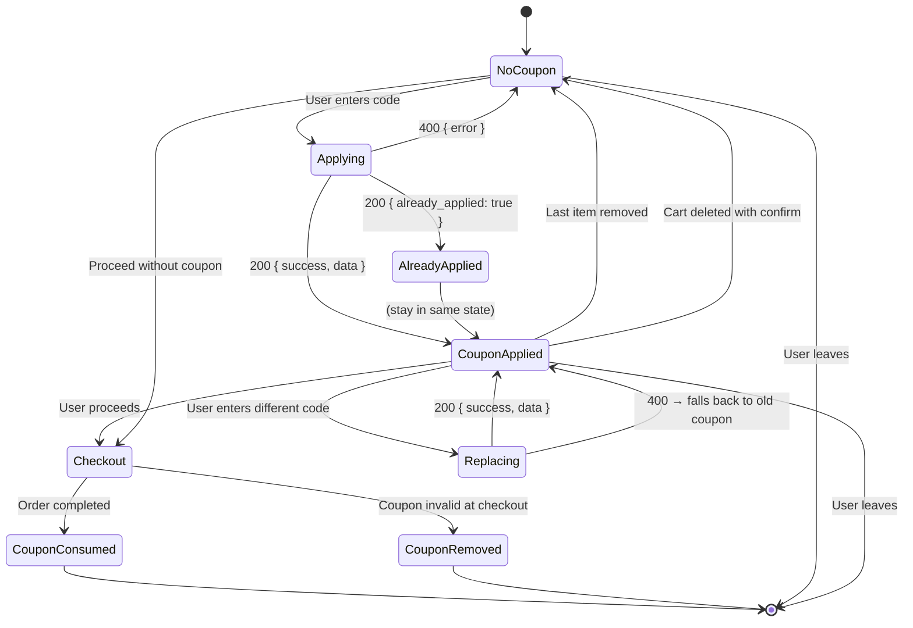
```mermaid
stateDiagram-v2
    [*] --> NoCoupon
    NoCoupon --> Applying: User enters code
    Applying --> CouponApplied: 200 { success, data }
    Applying --> NoCoupon: 400 { error }
    Applying --> AlreadyApplied: 200 { already_applied: true }

    CouponApplied --> Checkout: User proceeds
    CouponApplied --> Replacing: User enters different code
    Replacing --> CouponApplied: 200 { success, data }
    Replacing --> CouponApplied: 400 → falls back to old coupon

    CouponApplied --> NoCoupon: Last item removed
    CouponApplied --> NoCoupon: Cart deleted with confirm

    Checkout --> CouponConsumed: Order completed
    Checkout --> CouponRemoved: Coupon invalid at checkout

    CouponConsumed --> [*]
    CouponRemoved --> [*]
    NoCoupon --> Checkout: Proceed without coupon
    NoCoupon --> [*]: User leaves
    CouponApplied --> [*]: User leaves
    AlreadyApplied --> CouponApplied: (stay in same state)
```

### UI Recommendations

#### Coupon Input Field
- Place above the order summary / total section
- Show a text input + "Apply" button
- Disable the button while the request is in-flight
- Show a loading spinner on the button during the request

#### Coupon Applied State
- Change the input to a read-only display showing the coupon code
- Show the discount amount as a negative line item (e.g., "-$10.00")
- Show the updated total prominently
- Show a "Remove" or "Change" button to clear or replace the coupon

#### Coupon Error State
- Briefly show the error message (3-5 seconds)
- Clear the input field
- Keep the existing coupon (if any) intact — rollback the price

#### Checkout Revalidation
- Display a banner at the top of the checkout page re-checking the coupon validity (optional)
- After order success, if coupon was removed, show a one-time notice

### Response Handling Pseudocode

```
function applyCoupon(code):
    showLoading()
    try:
        response = POST /coupons/apply { code }
        if response.status == 200:
            if response.data.already_applied:
                showToast("Coupon already applied")
                return (no price change)
            updateCartTotal(response.data.total_price)
            updateDiscountDisplay(response.data.coupon_discount)
            markCouponAsApplied(code)
        else:
            rollbackPrice()
            showError(response.message)
    catch:
        rollbackPrice()
        showError("Could not apply coupon. Please try again.")
    finally:
        hideLoading()
```

---

## 8. API Response Changes

### CartResource Response (Before vs After)

**Before:** Cart resource returned only the coupon code string.

```json
{
    "id": 1,
    "user_id": 1,
    "coupon": "SUMMER24",
    "coupon_code": "SUMMER24",
    "status": "active",
    "total_price": 90.00,
    ...
}
```

**After:** Cart resource returns both the coupon code string AND a full coupon object.

```json
{
    "id": 1,
    "user_id": 1,
    "coupon": {
        "id": 1,
        "code": "coupon_A1B2C3D",
        "name": "Summer Sale",
        "image": {"desktop": null, "mobile": null},
        "borderColor": null,
        "borderless": false,
        "discount": 10.00,
        "discount_type": "Fixed discount",
        "max_discount_amount": null,
        "start_date": "2026-01-01",
        "end_date": "2026-12-31",
        "limiter": 100,
        "used": 15,
        "status": true,
        "is_valid": true,
        "created_at": "2026-01-01T00:00:00+00:00"
    },
    "coupon_code": "coupon_A1B2C3D",
    "status": "active",
    "total_price": 90.00,
    ...
}
```

**Backward Compatibility:** The `coupon_code` field remains as a simple string for any frontend code that reads it. The `coupon` field changed from a string to an object. Frontends that read `cart.coupon` as a string will break. Frontends that read `cart.coupon_code` are unaffected.

### CouponResource (is_valid field)

**Before:** The resource had commented-out `is_valid` append on the model:

```php
// protected $appends = ['is_valid'];
```

**After:** The resource computes `is_valid` using `CouponValidator::validate()`:

```php
'is_valid' => CouponValidator::validate($this)['valid'],
```

### OrderResource Response

**Before:** Order resource returned coupon-related fields inline.

**After:** Same structure — no changes to the order response format.

```json
{
    "id": 42,
    "coupon": "SUMMER24",
    "coupon_discount": 10.00,
    "coupon_discount_type": "fixed_rate",
    "promotion_discount": 0.00,
    "total": 145.00,
    ...
}
```

---

## 9. Database Changes

### ER Diagram

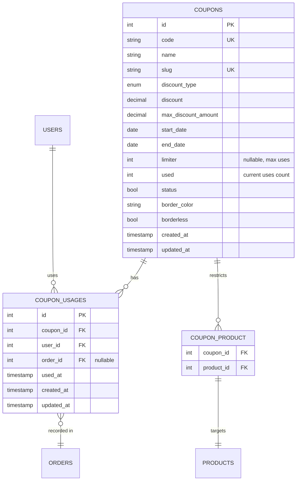
```mermaid
erDiagram
    COUPONS ||--o{ COUPON_USAGES : has
    COUPONS ||--o{ COUPON_PRODUCT : restricts
    COUPON_PRODUCT ||--|| PRODUCTS : targets
    USERS ||--o{ COUPON_USAGES : uses
    COUPON_USAGES }o--|| ORDERS : "recorded in"

    COUPONS {
        int id PK
        string code UK
        string name
        string slug UK
        enum discount_type
        decimal discount
        decimal max_discount_amount
        date start_date
        date end_date
        int limiter "nullable, max uses"
        int used "current uses count"
        bool status
        string border_color
        bool borderless
        timestamp created_at
        timestamp updated_at
    }

    COUPON_USAGES {
        int id PK
        int coupon_id FK
        int user_id FK
        int order_id FK "nullable"
        timestamp used_at
        timestamp created_at
        timestamp updated_at
    }

    COUPON_PRODUCT {
        int coupon_id FK
        int product_id FK
    }
```

### CouponUsage Table

The `coupon_usages` table records every successful consumption of a coupon by a user.

```sql
CREATE TABLE coupon_usages (
    id          BIGINT UNSIGNED AUTO_INCREMENT PRIMARY KEY,
    coupon_id   BIGINT UNSIGNED NOT NULL,
    user_id     BIGINT UNSIGNED NOT NULL,
    order_id    BIGINT UNSIGNED NULL,
    used_at     TIMESTAMP NULL,
    created_at  TIMESTAMP NULL,
    updated_at  TIMESTAMP NULL,
    FOREIGN KEY (coupon_id) REFERENCES coupons(id) ON DELETE CASCADE,
    FOREIGN KEY (user_id)   REFERENCES users(id)   ON DELETE CASCADE,
    FOREIGN KEY (order_id)  REFERENCES orders(id)  ON DELETE CASCADE
);
```

**Indexes:** The `firstOrCreate()` call uses a composite match on `[coupon_id, user_id]`. A composite index on `(coupon_id, user_id)` is recommended for performance.

### `used` Column

The `coupons.used` column tracks how many distinct users have consumed the coupon:

```php
$coupon->increment('used');
```

This is incremented only when `$couponUsage->wasRecentlyCreated` is true — meaning each user increments it at most once.

### `limiter` Column

The `coupons.limiter` column defines the maximum number of distinct users who can consume the coupon:

```php
if ($coupon->limiter !== null && $coupon->used >= $coupon->limiter) {
    return self::invalid('usage_limit_reached', ...);
}
```

- A `limiter` of `null` means unlimited uses.
- `used` starts at 0 and is incremented per user.
- When `used >= limiter`, the coupon cannot be used further.

### Why Immutable History Matters

The `firstOrCreate()` pattern with the composite key `[coupon_id, user_id]` ensures:

1. **No duplicate increments** — No matter how many times `recordCouponUsage()` is called for the same user + coupon pair, `used` is only incremented once.
2. **Idempotent payment flows** — If a payment webhook fires multiple times, the coupon usage is recorded only once.
3. **Audit trail** — The original `order_id` and `used_at` from the first consumption are preserved.
4. **No race conditions** — The database unique constraint (enforced by `firstOrCreate` which is atomic) prevents concurrent duplicate entries.

---

## 10. Validation Pipeline

### CouponValidator Flow

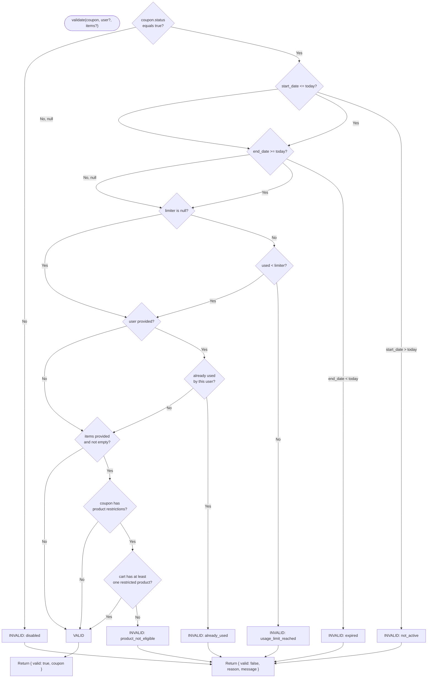
```mermaid
flowchart TD
    Start(["validate(coupon, user?, items?)"])
    S1{"coupon.status\nequals true?"}
    S1 -->|"No"| Invalid1["INVALID: disabled"]
    S1 -->|"Yes"| S2{"start_date <= today?"}
    S2 -->|"No, null"| S3
    S2 -->|"Yes"| S3
    S2 -->|"start_date > today"| Invalid2["INVALID: not_active"]
    S3{"end_date >= today?"}
    S3 -->|"No, null"| S4
    S3 -->|"Yes"| S4
    S3 -->|"end_date < today"| Invalid3["INVALID: expired"]
    S4{"limiter is null?"}
    S4 -->|"Yes"| S5
    S4 -->|"No"| S4b{"used < limiter?"}
    S4b -->|"Yes"| S5
    S4b -->|"No"| Invalid4["INVALID: usage_limit_reached"]
    S5{"user provided?"}
    S5 -->|"No"| S6
    S5 -->|"Yes"| S5b{"already used\nby this user?"}
    S5b -->|"No"| S6
    S5b -->|"Yes"| Invalid5["INVALID: already_used"]
    S6{"items provided\nand not empty?"}
    S6 -->|"No"| Valid["VALID"]
    S6 -->|"Yes"| S6b{"coupon has\nproduct restrictions?"}
    S6b -->|"No"| Valid
    S6b -->|"Yes"| S6c{"cart has at least\none restricted product?"}
    S6c -->|"Yes"| Valid
    S6c -->|"No"| Invalid6["INVALID: product_not_eligible"]

    Invalid1 --> ReturnInvalid["Return { valid: false, reason, message }"]
    Invalid2 --> ReturnInvalid
    Invalid3 --> ReturnInvalid
    Invalid4 --> ReturnInvalid
    Invalid5 --> ReturnInvalid
    Invalid6 --> ReturnInvalid
    Valid --> ReturnValid["Return { valid: true, coupon }"]
```

### Validation Order

The order of checks in `CouponValidator::validate()` is intentional:

1. **Status check** (fastest, no DB query)
2. **Date checks** (no DB query — uses model attributes)
3. **Limiter check** (no DB query — uses model attributes)
4. **Already-used check** (DB query: `CouponUsage::exists()`)
5. **Product restriction check** (DB query: `coupon->products()->pluck()`)

This ordering means the cheapest checks fail first, minimizing database queries for common failure cases.

### Why Validation Happens Twice

**First validation (at apply time):**
- When the user applies the coupon, `CouponValidator::validateByCode()` is called
- Ensures the coupon is valid at the moment of application
- Gives immediate feedback: "This coupon is expired" etc.
- Prevents invalid coupons from being stored on the cart

**Second validation (at checkout time):**
- When the user submits the order, `OrderService::addItemsInOrder()` re-validates the coupon
- Catches the case where a coupon was valid when applied but expired between apply and checkout
- Catches the case where the usage limit was reached by another user between apply and checkout
- Catches the case where the cart contents changed and no longer match product restrictions

**Why not validate once?**
- A coupon that is valid at apply time can become invalid by checkout time (minutes or hours later)
- The cart contents can change between apply and checkout (items added/removed)
- Revalidation is cheap (same code path, same validator) and prevents edge-case bugs

### validateByCode vs validate

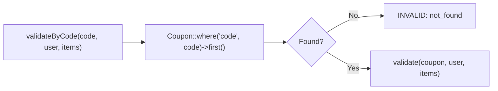
```mermaid
flowchart LR
    validateByCode["validateByCode(code, user, items)"]
    lookup["Coupon::where('code', code)->first()"]
    found{"Found?"}
    notFound["INVALID: not_found"]
    validate["validate(coupon, user, items)"]

    validateByCode --> lookup --> found
    found -->|"No"| notFound
    found -->|"Yes"| validate
```

`validateByCode()` is a convenience wrapper that:
1. Looks up the coupon by code
2. Returns `not_found` if no coupon exists
3. Delegates to `validate()` if found

`validate()` is the core validation that takes an already-loaded Coupon model, avoiding an extra DB query when the caller already has the coupon.

---

## 11. Calculation Pipeline

### CouponCalculator Flow

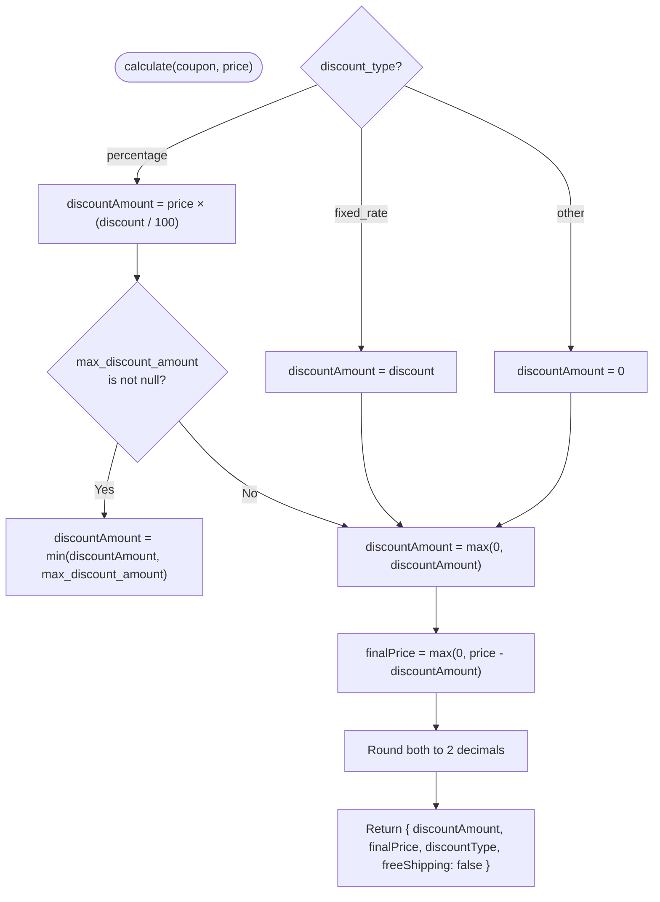
```mermaid
flowchart TD
    Start(["calculate(coupon, price)"])
    DiscountType{"discount_type?"}
    DiscountType -->|"percentage"| CalcPct["discountAmount = price × (discount / 100)"]
    CalcPct --> HasMax{"max_discount_amount\nis not null?"}
    HasMax -->|"Yes"| CapMax["discountAmount = min(discountAmount, max_discount_amount)"]
    HasMax -->|"No"| ApplyFloor
    DiscountType -->|"fixed_rate"| Fixed["discountAmount = discount"]
    Fixed --> ApplyFloor
    DiscountType -->|"other"| Zero["discountAmount = 0"]
    Zero --> ApplyFloor

    ApplyFloor["discountAmount = max(0, discountAmount)"]
    ApplyFloor --> FinalPrice["finalPrice = max(0, price - discountAmount)"]
    FinalPrice --> Round["Round both to 2 decimals"]
    Round --> Return["Return { discountAmount, finalPrice, discountType, freeShipping: false }"]
```

### Percentage Discount

```php
// Coupon.discount = 15 (15%)
// Cart total = 200.00
$discountAmount = 200.00 * (15 / 100);  // = 30.00
$finalPrice = max(0, 200.00 - 30.00);    // = 170.00
```

### Fixed Rate Discount

```php
// Coupon.discount = 25.00
// Cart total = 100.00
$discountAmount = 25.00;
$finalPrice = max(0, 100.00 - 25.00);    // = 75.00
```

### Percentage with Maximum Cap

```php
// Coupon.discount = 20 (20%)
// Coupon.max_discount_amount = 50.00
// Cart total = 500.00
$discountAmount = 500.00 * (20 / 100);   // = 100.00
$discountAmount = min(100.00, 50.00);     // = 50.00 (capped)
$finalPrice = max(0, 500.00 - 50.00);     // = 450.00
```

### Zero Floor

```php
// Coupon.discount = 200.00 (fixed)
// Cart total = 50.00
$discountAmount = 200.00;
$finalPrice = max(0, 50.00 - 200.00);     // = 0.00 (not -150.00)
```

The `max(0, ...)` ensures prices never go negative. The `discountAmount` in the returned array is the raw calculated discount (200.00), not capped at the price. The `finalPrice` is always capped at 0 minimum. This allows the frontend to display the full discount amount even if the cart total is smaller.

### Return Structure

```json
{
    "discountAmount": 30.00,
    "finalPrice": 170.00,
    "discountType": "percentage",
    "freeShipping": false
}
```

- `discountAmount`: The actual monetary discount applied.
- `finalPrice`: The price after the discount (minimum 0).
- `discountType`: The type of discount (`percentage` or `fixed_rate`).
- `freeShipping`: Reserved for future use (currently always `false`).

---

## 12. Removed Technical Debt

### 1. Duplicate Validation Logic

**Before:** Validation existed in three places:
- `Coupon::isValid()` — model method (deprecated)
- `CouponService::addCouponToCart()` — inline checks
- `CouponRepository::verifyCoupon()` — inline checks (commented out)

**After:** All validation in `CouponValidator::validate()`.

**Benefit:** Single code path to audit, test, and modify. New rules are added in one place.

### 2. Duplicate Calculation Logic

**Before:** Calculation existed in two places:
- `Coupon::calcPrice()` — model method (deprecated)
- `ProductPricingService::calculateCouponPrice()` — separate implementation

**After:** All calculation in `CouponCalculator::calculate()`.

**Benefit:** Consistent pricing. The `calculate()` result includes discount metadata that `calcPrice()` never provided.

### 3. Duplicate Usage Recording

**Before:** Two separate `recordCouponUsage()` methods:
- `OrderRepository::recordCouponUsage()` — used `create()` (no duplicate protection)
- `OrderService::recordCouponUsage()` — used `firstOrCreate()` (idempotent)

**After:** Only `OrderService::recordCouponUsage()` is used for the new flow. The package `OrderRepository` method remains for backward compatibility with the old order creation path.

**Benefit:** No more duplicate usage records. Idempotent payment processing.

### 4. Mixed Responsibilities in Coupon Model

**Before:** The Coupon model handled:
- Database mapping
- Validation (`isValid()`)
- Calculation (`calcPrice()`)
- Query scopes (`scopeValid`, `scopeInvalid`)

**After:** The model handles:
- Database mapping
- Relationships
- Query scopes

**Benefit:** The model follows Single Responsibility Principle. New validation or calculation rules don't require modifying the model.

### 5. Missing Product Restriction Validation

**Before:** Never checked whether the cart contents matched the coupon's product restrictions.

**After:** `CouponValidator::validate()` checks `coupon->products()` against cart item product IDs.

**Benefit:** Coupons with product restrictions work correctly.

### 6. Missing Already-Used Validation

**Before:** No check for whether the user had already used the coupon.

**After:** `CouponValidator::validate()` checks `CouponUsage::exists()` for the user + coupon pair.

**Benefit:** Users cannot consume a coupon more than once. The `firstOrCreate()` in `recordCouponUsage()` is the enforcement mechanism.

---

## 13. Performance

### Database Queries

| Operation | Before (Old) | After (New) | Improvement |
|---|---|---|---|
| Apply coupon | 3-5 queries (varied by path) | 3 max queries (lookup + usage check + product check) | Consistent, predictable |
| Checkout revalidation | 0 queries (no validation) | 2 max queries (lookup + usage + product) | Added safety with minimal cost |
| Payment usage recording | 2 queries (create + update) | 2 queries (firstOrCreate + conditional increment) | Same cost, added safety |
| Cart resource display | 0 queries for validation | 0 extra (validator uses same loaded model) | No regression |

### Query Reuse

The `CouponValidator::validate()` method performs at most 3 database queries:
1. `Coupon::where('code', ...)->first()` — in `validateByCode()` only; skipped if the caller already has the Coupon model
2. `CouponUsage::where('coupon_id', ...)->where('user_id', ...)->exists()` — only if user is provided
3. `$coupon->products()->pluck('product_id')` — only if items are provided and non-empty

All other checks (status, dates, limiter) use in-memory model attributes with zero database queries.

### Validator Cache Profile

The validator is intentionally **not cached** at the service level because:
- Each validation call is already minimal (0-3 queries)
- The data changes frequently (`used` count increments, coupons expire daily)
- Caching would require cache invalidation on every coupon usage
- The "checkout revalidation" path runs inside a database transaction, where stale cache would be harmful

### Calculator Performance

`CouponCalculator::calculate()` is a pure function:
- Zero database queries
- Zero service dependencies
- Zero I/O
- Pure float arithmetic

It can be called hundreds of times in a single request without measurable overhead.

### Query Scopes

The `Coupon::scopeValid()` and `Coupon::scopeInvalid()` scopes are database-level filters used for list queries (e.g., admin dashboard, coupon listing). They:

- Use `where` clauses on indexed columns (`status`, `start_date`, `end_date`)
- Are NOT a replacement for `CouponValidator` (they don't check product restrictions or user history)
- Are query optimizations that prevent loading clearly invalid coupons from the database

### Caching Opportunities

The dashboard analytics `getCouponAnalytics()` uses `Cache::remember('dashboard_coupon_analytics', 300 seconds, ...)`. This is appropriate because:
- Dashboard data is viewed by admins only
- 5 minute TTL is acceptable for analytics views
- Stale analytics data does not affect business operations

---

## 14. Error Handling

### Error Response Table

| `reason` | HTTP Code | Message | Frontend Action |
|---|---|---|---|
| `not_found` | 400 | Generic invalid message | Show error toast, clear input |
| `disabled` | 400 | Generic invalid message | Show error toast, clear input |
| `expired` | 400 | Generic invalid message | Show error toast, clear input |
| `not_active` | 400 | Generic invalid message | Show error toast, clear input |
| `usage_limit_reached` | 400 | Generic invalid message | Show "Coupon usage limit reached" |
| `already_used` | 400 | Generic invalid message | Show "You have already used this coupon" |
| `product_not_eligible` | 400 | Generic invalid message | Show "This coupon is not valid for items in your cart" |
| Already applied (same code) | 200 | "Coupon already applied" | Show toast, no price change |
| No cart | 400 | "Cart not found" | Show "Please add items to your cart first" |
| Empty cart | 400 | "Cart is empty" | Show "Your cart is empty" |
| No auth | 401 | Unauthenticated | Redirect to login |
| Rate limited | 429 | Too many requests | Show "Please wait before trying again" |

### CouponValidator Reason/Messages

| `reason` | `message` (English key) | Meaning |
|---|---|---|
| `disabled` | `coupon.disabled` | Coupon status is false |
| `not_active` | `coupon.not_yet_active` | start_date is in the future |
| `expired` | `coupon.expired` | end_date has passed |
| `usage_limit_reached` | `coupon.usage_limit_reached` | used >= limiter |
| `already_used` | `coupon.already_used` | user has a CouponUsage record |
| `product_not_eligible` | `coupon.product_not_eligible` | cart has none of the coupon's products |
| `not_found` | `coupon.not_found` | no coupon with this code |

### Error Propagation

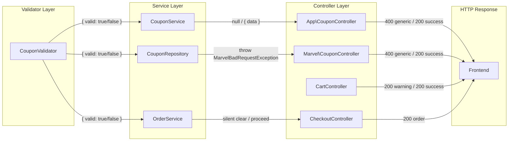
```mermaid
flowchart LR
    subgraph "Validator Layer"
        Validator["CouponValidator"]
    end
    subgraph "Service Layer"
        CouponSvc["CouponService"]
        OrderSvc["OrderService"]
        CouponRepo["CouponRepository"]
    end
    subgraph "Controller Layer"
        AppCtrl["App\CouponController"]
        MarvelCtrl["Marvel\CouponController"]
        CartCtrl["CartController"]
        CheckoutCtrl["CheckoutController"]
    end
    subgraph "HTTP Response"
        FE["Frontend"]
    end

    Validator -->|"{ valid: true/false }"| CouponSvc
    Validator -->|"{ valid: true/false }"| CouponRepo
    Validator -->|"{ valid: true/false }"| OrderSvc

    CouponSvc -->|"null / { data }"| AppCtrl
    CouponRepo -->|"throw MarvelBadRequestException"| MarvelCtrl
    OrderSvc -->|"silent clear / proceed"| CheckoutCtrl

    AppCtrl -->|"400 generic / 200 success"| FE
    MarvelCtrl -->|"400 generic / 200 success"| FE
    CartCtrl -->|"200 warning / 200 success"| FE
    CheckoutCtrl -->|"200 order"| FE
```

Key design decision: The controller layer translates the validator's specific reasons into generic user-facing messages. The specific reason is always available in the response array internally but is not exposed via HTTP to prevent information leakage.

---

## 15. Testing

### Test Coverage Summary

| Test File | Type | Tests | Assertions | Covers |
|---|---|---|---|---|
| `CouponCalculatorTest.php` | Unit | 8 | 20 | All calculator edge cases |
| `CouponValidatorTest.php` | Unit | 16 | 43 | All validation reasons |
| `CouponSystemTest.php` | Feature | 18 | 39 | Full HTTP flows |
| `DashboardTest.php` | Feature | 26 | 218 | Coupon analytics endpoint |
| `PaymentSystemTest.php` | Feature | 29 | 58 | Coupon usage recording |

### Unit Tests: CouponCalculatorTest

**File:** `tests/Unit/CouponCalculatorTest.php`

| Test | What It Verifies |
|---|---|
| `test_fixed_discount_calculates_correctly` | Fixed rate: 100 - 10 = 90 |
| `test_percentage_discount_calculates_correctly` | Percentage: 100 * 10% = 10 discount |
| `test_percentage_with_max_cap` | Percentage capped at max_discount_amount |
| `test_zero_discount_returns_same_price` | Discount = 0 → price unchanged |
| `test_full_discount_does_not_make_price_negative` | Discount > price → finalPrice = 0 (not negative) |
| `test_discount_amount_is_raw_not_capped` | discountAmount is the raw calculated discount, not capped at price |
| `test_non_percentage_non_fixed_returns_zero_discount` | Unknown type → 0 discount |
| `test_percentage_above_100_still_works` | 200% discount still results in finalPrice = 0 |

### Unit Tests: CouponValidatorTest

**File:** `tests/Unit/CouponValidatorTest.php`

| Test | What It Verifies |
|---|---|
| `test_valid_coupon_passes_validation` | All conditions met → valid |
| `test_disabled_coupon_fails_validation` | status=false → reason=disabled |
| `test_expired_coupon_fails_validation` | end_date in past → reason=expired |
| `test_not_yet_active_coupon_fails_validation` | start_date in future → reason=not_active |
| `test_usage_limit_reached_fails_validation` | used >= limiter → reason=usage_limit_reached |
| `test_null_limiter_allows_unlimited_usage` | limiter=null → passes (no limit) |
| `test_already_used_fails_for_same_user` | user has CouponUsage → reason=already_used |
| `test_different_user_not_affected` | different user → passes |
| `test_product_not_eligible_fails` | cart has no restricted products → reason=product_not_eligible |
| `test_product_eligible_passes` | cart has at least one restricted product → passes |
| `test_null_items_skips_product_check` | items=null → skips product check, passes |
| `test_empty_items_skips_product_check` | items=collect([]) → skips product check, passes |
| `test_validate_by_code_not_found` | non-existent code → reason=not_found |
| `test_validate_by_code_found` | existing code → valid |
| `test_validate_returns_correct_structure_valid` | valid result has all expected keys |
| `test_validate_returns_correct_structure_invalid` | invalid result has all expected keys |

### Feature Tests: CouponSystemTest

**File:** `tests/Feature/CouponSystemTest.php`

| Test | What It Verifies |
|---|---|
| HTTP apply valid coupon | 200 with total_price and coupon_discount |
| HTTP apply same coupon twice | 200 with already_applied=true |
| HTTP apply different coupon replaces | Replaces coupon on cart |
| HTTP apply expired coupon | 400 |
| HTTP apply disabled coupon | 400 |
| HTTP apply usage_limit_reached | 400 |
| HTTP apply non-existent coupon | 400 |
| HTTP apply without auth | 401 |
| HTTP apply without cart | 400 |
| HTTP apply already_used | 400 |
| HTTP apply product_not_eligible | 400 |
| HTTP delete last item clears coupon | Remaining=0 → coupon cleared |
| HTTP delete cart with coupon warns | Warning before confirm |
| HTTP delete cart with confirm resets | Items deleted, coupon cleared, total_price=0 |
| Service: checkout revalidation | Expired coupon cleared at checkout |
| Service: markCodAsPaid records usage | CouponUsage created, used incremented |
| Service: changeOrderStatus records usage | CouponUsage created on status=completed |
| Service: firstOrCreate prevents duplicates | Same user+coupon not recorded twice |

### Feature Tests: PaymentSystemTest (Coupon-related)

| Test | What It Verifies |
|---|---|
| `mark_cod_as_paid_records_coupon_usage` | COD payment creates CouponUsage record |

### Feature Tests: DashboardTest (Coupon-related)

| Test | What It Verifies |
|---|---|
| `test_coupon_analytics_returns_usage_and_revenue` | Dashboard coupons endpoint returns total_usage, top_coupons, revenue_by_coupon, total_coupon_discount |

### Test Architecture Decisions

1. **Unit tests use `RefreshDatabase`** — The CouponValidatorTest and CouponCalculatorTest need the database for model creation and `CouponUsage` queries.
2. **Feature tests use `RefreshDatabase`** — CouponSystemTest uses `RefreshDatabase` for clean state.
3. **PaymentSystemTest uses `DatabaseTransactions`** — It manually creates its own table schema, so `RefreshDatabase` would not work correctly.
4. **No mocked services** — All tests use real implementations (CouponValidator, CouponCalculator) to verify actual behavior.
5. **No external HTTP calls** — All tests are self-contained with seeded data.

---

## 16. Production Readiness Checklist

### Verification Checklist

- [x] All unit tests pass: 24 tests, 63 assertions
- [x] All feature tests pass: 73 tests, 315 assertions
- [x] All dashboard tests pass: 26 tests, 218 assertions
- [x] All payment tests pass: 29 tests, 58 assertions
- [x] No skipped or incomplete tests
- [x] No TODO/FIXME comments in coupon implementation
- [x] No deprecated Coupon methods called in production code
- [x] Single validation pipeline (CouponValidator)
- [x] Single calculation pipeline (CouponCalculator)
- [x] Two-phase validation (apply + checkout)
- [x] Idempotent usage recording (firstOrCreate)
- [x] Auto-clearing coupon on empty cart
- [x] Warning before cart delete with coupon
- [x] Zero floor on all price calculations
- [x] Product restriction validation
- [x] Already-used validation
- [x] Limiter validation
- [x] Date range validation
- [x] Status validation
- [x] Translation keys defined for all error messages
- [ ] Translation files created (`resources/lang/{en,ar}/coupon.php`)

### Monitoring Recommendations

1. **Log coupon validation failures** — Track which reasons are most common (expired, limit reached, etc.)
2. **Monitor `used` vs `limiter`** — Identify coupons approaching their limit
3. **Track checkout revalidation drops** — Count how many coupons are silently removed at checkout
4. **Alert on duplicate `increment('used')` calls** — While `firstOrCreate()` prevents this, monitor for unexpected behavior

### Rollback Plan

If issues are discovered post-deployment:

1. **Disable coupon validation** — Set a feature flag to skip `CouponValidator` and fall back to basic scopes
2. **Restore deprecated methods** — `Coupon::isValid()` and `Coupon::calcPrice()` are still present and unchanged
3. **Revert to `create()`** — Change `firstOrCreate()` back to `create()` in `OrderService::recordCouponUsage()`
4. **Rollback via git** — All changes are in isolated commits, reverting is straightforward

### Future Improvements (Non-Blocking)

1. **Translation files** — Create `resources/lang/{en,ar}/coupon.php` with human-readable messages
2. **Checkout endpoint optimization** — Add optional `?verify_coupon=1` query parameter to return coupon revalidation status in checkout response
3. **Admin dashboard** — Add `total_discount` (including promotion_discount) alongside `total_coupon_discount`
4. **Cache warmup** — Pre-warm dashboard analytics cache after coupon updates
5. **Soft-delete cleanup** — Add scheduled job to clean up expired coupon_usages for GDPR compliance

---

## 17. Complete Sequence Diagrams

### 17.1 Apply Coupon

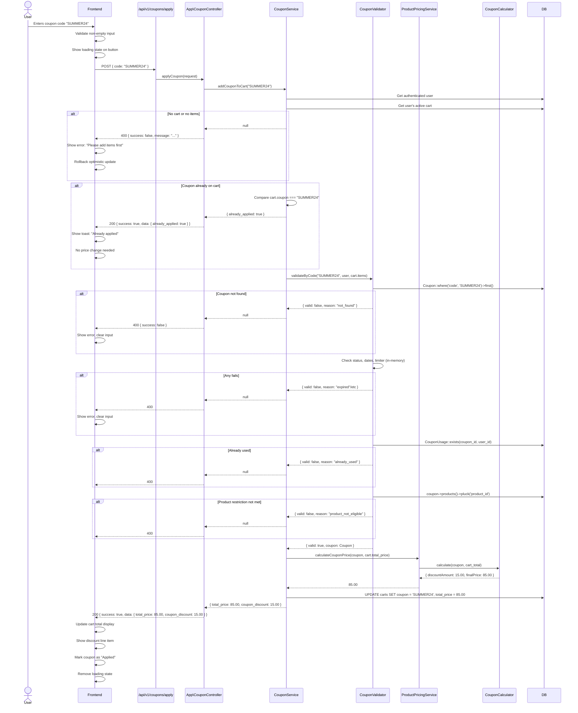
```mermaid
sequenceDiagram
    actor User
    participant FE as Frontend
    participant API as /api/v1/coupons/apply
    participant Ctrl as App\CouponController
    participant Svc as CouponService
    participant Validator as CouponValidator
    participant Pricing as ProductPricingService
    participant Calculator as CouponCalculator
    participant DB

    User->>FE: Enters coupon code "SUMMER24"
    FE->>FE: Validate non-empty input
    FE->>FE: Show loading state on button

    FE->>API: POST { code: "SUMMER24" }
    API->>Ctrl: applyCoupon(request)
    Ctrl->>Svc: addCouponToCart("SUMMER24")

    Svc->>DB: Get authenticated user
    Svc->>DB: Get user's active cart

    alt No cart or no items
        Svc-->>Ctrl: null
        Ctrl-->>FE: 400 { success: false, message: "..." }
        FE->>FE: Show error: "Please add items first"
        FE->>FE: Rollback optimistic update
    end

    alt Coupon already on cart
        Svc->>Svc: Compare cart.coupon === "SUMMER24"
        Svc-->>Ctrl: { already_applied: true }
        Ctrl-->>FE: 200 { success: true, data: { already_applied: true } }
        FE->>FE: Show toast: "Already applied"
        FE->>FE: No price change needed
    end

    Svc->>Validator: validateByCode("SUMMER24", user, cart.items)

    Validator->>DB: Coupon::where('code', 'SUMMER24')->first()
    alt Coupon not found
        Validator-->>Svc: { valid: false, reason: "not_found" }
        Svc-->>Ctrl: null
        Ctrl-->>FE: 400 { success: false }
        FE->>FE: Show error, clear input
    end

    Validator->>Validator: Check status, dates, limiter (in-memory)
    alt Any fails
        Validator-->>Svc: { valid: false, reason: "expired"/etc }
        Svc-->>Ctrl: null
        Ctrl-->>FE: 400
        FE->>FE: Show error, clear input
    end

    Validator->>DB: CouponUsage::exists(coupon_id, user_id)
    alt Already used
        Validator-->>Svc: { valid: false, reason: "already_used" }
        Svc-->>Ctrl: null
        Ctrl-->>FE: 400
    end

    Validator->>DB: coupon->products()->pluck('product_id')
    alt Product restriction not met
        Validator-->>Svc: { valid: false, reason: "product_not_eligible" }
        Svc-->>Ctrl: null
        Ctrl-->>FE: 400
    end

    Validator-->>Svc: { valid: true, coupon: Coupon }

    Svc->>Pricing: calculateCouponPrice(coupon, cart.total_price)
    Pricing->>Calculator: calculate(coupon, cart_total)
    Calculator-->>Pricing: { discountAmount: 15.00, finalPrice: 85.00 }
    Pricing-->>Svc: 85.00

    Svc->>DB: UPDATE carts SET coupon = 'SUMMER24', total_price = 85.00

    Svc-->>Ctrl: { total_price: 85.00, coupon_discount: 15.00 }
    Ctrl-->>FE: 200 { success: true, data: { total_price: 85.00, coupon_discount: 15.00 } }

    FE->>FE: Update cart total display
    FE->>FE: Show discount line item
    FE->>FE: Mark coupon as "Applied"
    FE->>FE: Remove loading state
```

### 17.2 Replace Coupon

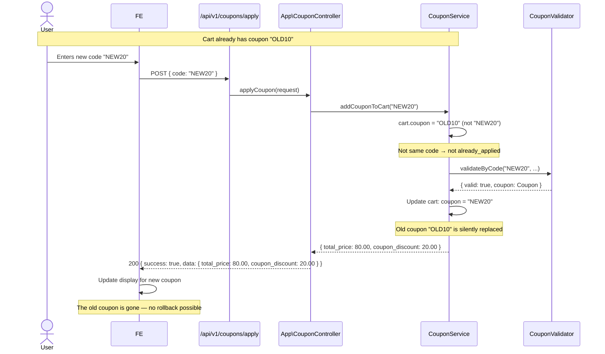
```mermaid
sequenceDiagram
    actor User
    participant FE
    participant API as /api/v1/coupons/apply
    participant Ctrl as App\CouponController
    participant Svc as CouponService
    participant Validator as CouponValidator

    Note over User,Svc: Cart already has coupon "OLD10"
    User->>FE: Enters new code "NEW20"
    FE->>API: POST { code: "NEW20" }
    API->>Ctrl: applyCoupon(request)
    Ctrl->>Svc: addCouponToCart("NEW20")

    Svc->>Svc: cart.coupon = "OLD10" (not "NEW20")
    Note over Svc: Not same code → not already_applied

    Svc->>Validator: validateByCode("NEW20", ...)
    Validator-->>Svc: { valid: true, coupon: Coupon }

    Svc->>Svc: Update cart: coupon = "NEW20"
    Note over Svc: Old coupon "OLD10" is silently replaced

    Svc-->>Ctrl: { total_price: 80.00, coupon_discount: 20.00 }
    Ctrl-->>FE: 200 { success: true, data: { total_price: 80.00, coupon_discount: 20.00 } }

    FE->>FE: Update display for new coupon
    Note over FE: The old coupon is gone — no rollback possible
```

### 17.3 Checkout

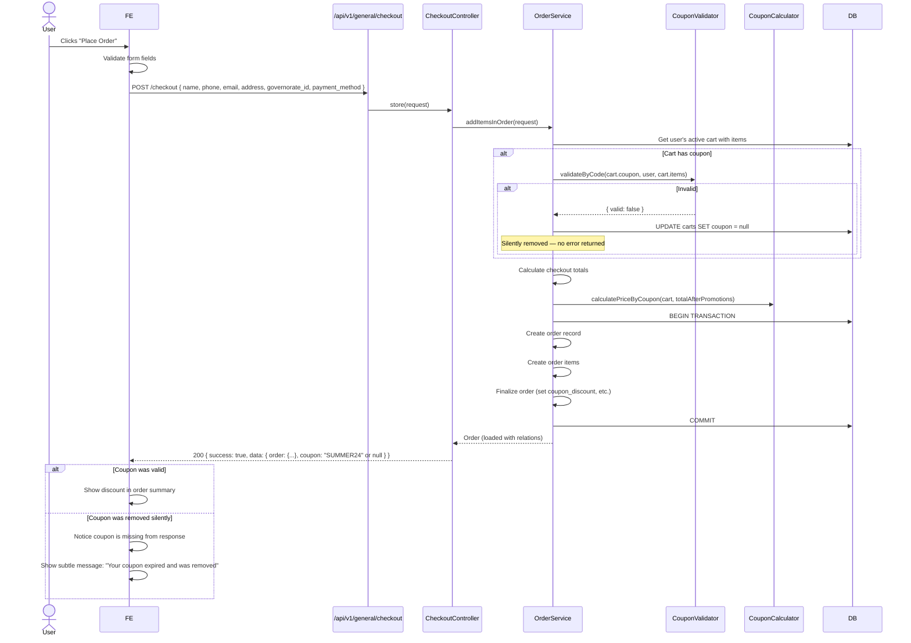
```mermaid
sequenceDiagram
    actor User
    participant FE
    participant API as /api/v1/general/checkout
    participant Ctrl as CheckoutController
    participant OrderSvc as OrderService
    participant Validator as CouponValidator
    participant Calculator as CouponCalculator
    participant DB

    User->>FE: Clicks "Place Order"
    FE->>FE: Validate form fields

    FE->>API: POST /checkout { name, phone, email, address, governorate_id, payment_method }
    API->>Ctrl: store(request)

    Ctrl->>OrderSvc: addItemsInOrder(request)

    OrderSvc->>DB: Get user's active cart with items

    alt Cart has coupon
        OrderSvc->>Validator: validateByCode(cart.coupon, user, cart.items)
        alt Invalid
            Validator-->>OrderSvc: { valid: false }
            OrderSvc->>DB: UPDATE carts SET coupon = null
            Note over OrderSvc: Silently removed — no error returned
        end
    end

    OrderSvc->>OrderSvc: Calculate checkout totals
    OrderSvc->>Calculator: calculatePriceByCoupon(cart, totalAfterPromotions)

    OrderSvc->>DB: BEGIN TRANSACTION
    OrderSvc->>OrderSvc: Create order record
    OrderSvc->>OrderSvc: Create order items
    OrderSvc->>OrderSvc: Finalize order (set coupon_discount, etc.)
    OrderSvc->>DB: COMMIT

    OrderSvc-->>Ctrl: Order (loaded with relations)
    Ctrl-->>FE: 200 { success: true, data: { order: {...}, coupon: "SUMMER24" or null } }

    alt Coupon was valid
        FE->>FE: Show discount in order summary
    else Coupon was removed silently
        FE->>FE: Notice coupon is missing from response
        FE->>FE: Show subtle message: "Your coupon expired and was removed"
    end
```

### 17.4 Payment (COD Mark Paid)

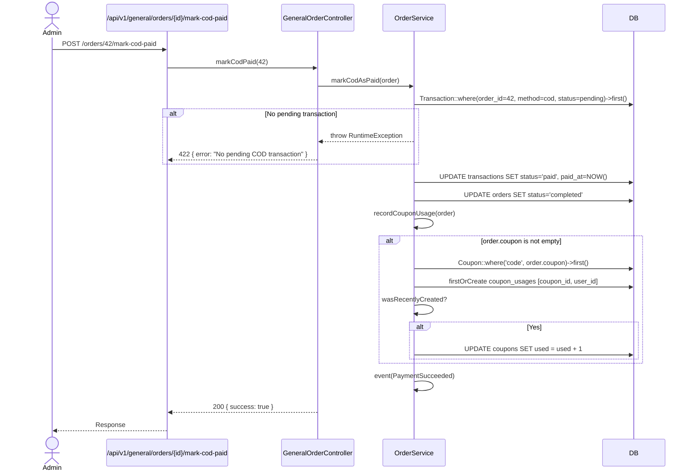
```mermaid
sequenceDiagram
    actor Admin
    participant API as /api/v1/general/orders/{id}/mark-cod-paid
    participant Ctrl as GeneralOrderController
    participant OrderSvc as OrderService
    participant DB

    Admin->>API: POST /orders/42/mark-cod-paid
    API->>Ctrl: markCodPaid(42)
    Ctrl->>OrderSvc: markCodAsPaid(order)

    OrderSvc->>DB: Transaction::where(order_id=42, method=cod, status=pending)->first()
    alt No pending transaction
        OrderSvc-->>Ctrl: throw RuntimeException
        Ctrl-->>API: 422 { error: "No pending COD transaction" }
    end

    OrderSvc->>DB: UPDATE transactions SET status='paid', paid_at=NOW()
    OrderSvc->>DB: UPDATE orders SET status='completed'
    OrderSvc->>OrderSvc: recordCouponUsage(order)

    alt order.coupon is not empty
        OrderSvc->>DB: Coupon::where('code', order.coupon)->first()
        OrderSvc->>DB: firstOrCreate coupon_usages [coupon_id, user_id]
        OrderSvc->>OrderSvc: wasRecentlyCreated?
        alt Yes
            OrderSvc->>DB: UPDATE coupons SET used = used + 1
        end
    end

    OrderSvc->>OrderSvc: event(PaymentSucceeded)

    Ctrl-->>API: 200 { success: true }
    API-->>Admin: Response
```

### 17.5 Cart Delete

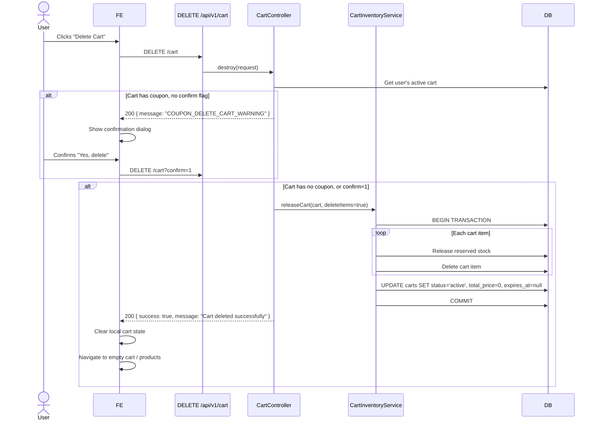
```mermaid
sequenceDiagram
    actor User
    participant FE
    participant API as DELETE /api/v1/cart
    participant Ctrl as CartController
    participant Inventory as CartInventoryService
    participant DB

    User->>FE: Clicks "Delete Cart"
    FE->>API: DELETE /cart
    API->>Ctrl: destroy(request)

    Ctrl->>DB: Get user's active cart

    alt Cart has coupon, no confirm flag
        Ctrl-->>FE: 200 { message: "COUPON_DELETE_CART_WARNING" }
        FE->>FE: Show confirmation dialog
        User->>FE: Confirms "Yes, delete"
        FE->>API: DELETE /cart?confirm=1
    end

    alt Cart has no coupon, or confirm=1
        Ctrl->>Inventory: releaseCart(cart, deleteItems=true)
        Inventory->>DB: BEGIN TRANSACTION
        loop Each cart item
            Inventory->>DB: Release reserved stock
            Inventory->>DB: Delete cart item
        end
        Inventory->>DB: UPDATE carts SET status='active', total_price=0, expires_at=null
        Inventory->>DB: COMMIT

        Ctrl-->>FE: 200 { success: true, message: "Cart deleted successfully" }
        FE->>FE: Clear local cart state
        FE->>FE: Navigate to empty cart / products
    end
```

### 17.6 Last Item Delete

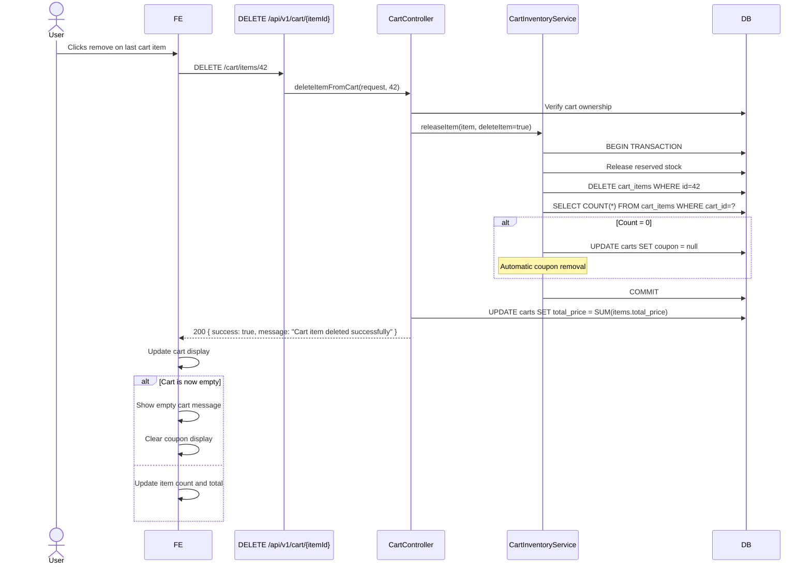
```mermaid
sequenceDiagram
    actor User
    participant FE
    participant API as DELETE /api/v1/cart/{itemId}
    participant Ctrl as CartController
    participant Inventory as CartInventoryService
    participant DB

    User->>FE: Clicks remove on last cart item
    FE->>API: DELETE /cart/items/42

    API->>Ctrl: deleteItemFromCart(request, 42)
    Ctrl->>DB: Verify cart ownership
    Ctrl->>Inventory: releaseItem(item, deleteItem=true)

    Inventory->>DB: BEGIN TRANSACTION
    Inventory->>DB: Release reserved stock
    Inventory->>DB: DELETE cart_items WHERE id=42
    Inventory->>DB: SELECT COUNT(*) FROM cart_items WHERE cart_id=?
    alt Count = 0
        Inventory->>DB: UPDATE carts SET coupon = null
        Note over Inventory: Automatic coupon removal
    end
    Inventory->>DB: COMMIT

    Ctrl->>DB: UPDATE carts SET total_price = SUM(items.total_price)
    Ctrl-->>FE: 200 { success: true, message: "Cart item deleted successfully" }

    FE->>FE: Update cart display
    alt Cart is now empty
        FE->>FE: Show empty cart message
        FE->>FE: Clear coupon display
    else
        FE->>FE: Update item count and total
    end
```

### 17.7 Expired Coupon

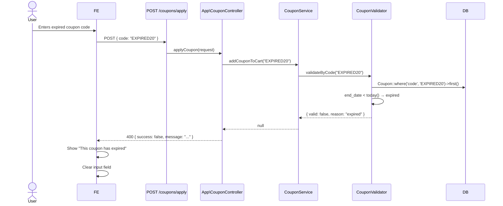
```mermaid
sequenceDiagram
    actor User
    participant FE
    participant API as POST /coupons/apply
    participant Ctrl as App\CouponController
    participant Svc as CouponService
    participant Validator as CouponValidator

    User->>FE: Enters expired coupon code
    FE->>API: POST { code: "EXPIRED20" }
    API->>Ctrl: applyCoupon(request)
    Ctrl->>Svc: addCouponToCart("EXPIRED20")
    Svc->>Validator: validateByCode("EXPIRED20")

    Validator->>DB: Coupon::where('code', 'EXPIRED20')->first()
    Validator->>Validator: end_date < today() → expired

    Validator-->>Svc: { valid: false, reason: "expired" }
    Svc-->>Ctrl: null
    Ctrl-->>FE: 400 { success: false, message: "..." }
    FE->>FE: Show "This coupon has expired"
    FE->>FE: Clear input field
```

### 17.8 Disabled Coupon

```mermaid
sequenceDiagram
    actor User
    participant FE
    participant API
    participant V as CouponValidator

    User->>FE: Enters code for disabled coupon
    FE->>API: POST { code: "DISABLED10" }

    API->>V: validateByCode("DISABLED10")
    V->>V: coupon.status = false → disabled

    V-->>API: { valid: false, reason: "disabled" }
    API-->>FE: 400
    FE->>FE: Show "This coupon is not active"
```

### 17.9 Limiter Reached

```mermaid
sequenceDiagram
    actor User
    participant FE
    participant API
    participant V as CouponValidator

    User->>FE: Enters code for fully-used coupon
    FE->>API: POST { code: "POPULAR50" }

    API->>V: validateByCode("POPULAR50")
    V->>V: coupon.used (100) >= coupon.limiter (100) → limit reached

    V-->>API: { valid: false, reason: "usage_limit_reached" }
    API-->>FE: 400
    FE->>FE: Show "This coupon has reached its usage limit"
```

### 17.10 Product Restriction

```mermaid
sequenceDiagram
    actor User
    participant FE
    participant API
    participant V as CouponValidator

    User->>FE: Enters code for product-restricted coupon
    FE->>API: POST { code: "PROD20" }

    API->>V: validateByCode("PROD20", user, cart.items)
    V->>DB: SELECT product_id FROM coupon_product WHERE coupon_id=?
    Note over V: Restricted to product IDs [1, 2, 3]
    V->>V: Cart has products [5, 6] → intersection is empty
    V-->>API: { valid: false, reason: "product_not_eligible" }

    API-->>FE: 400
    FE->>FE: Show "This coupon doesn't apply to items in your cart"
```

### 17.11 Already Used

```mermaid
sequenceDiagram
    actor User
    participant FE
    participant API
    participant V as CouponValidator
    participant DB

    User->>FE: Enters code for already-used coupon
    FE->>API: POST { code: "ONETIME10" }

    API->>V: validateByCode("ONETIME10", user, items)
    V->>DB: Coupon::where('code', 'ONETIME10')->first()
    V->>V: Check status, dates, limiter (all pass)

    V->>DB: CouponUsage::exists(coupon_id=5, user_id=42)
    Note over V: User already used this coupon
    V-->>API: { valid: false, reason: "already_used" }

    API-->>FE: 400
    FE->>FE: Show "You have already used this coupon"
```

---

## 18. Frontend Developer Cheat Sheet

### Quick Reference Table

| API Returns | Frontend Should Do |
|---|---|
| `200 { data: { total_price, coupon_discount } }` | Update cart total + show discount line item |
| `200 { data: { already_applied: true } }` | Show toast "Already applied", no price change |
| `400 { success: false }` (apply coupon) | Clear input, show generic error, rollback price |
| `200 { message: "COUPON_DELETE_CART_WARNING" }` | Show confirmation dialog |
| `200 { message: "Cart deleted successfully" }` | Clear local cart state |
| `200 { data: { order: {...} } }` (checkout) | Check if `order.coupon` is null → coupon was removed |
| Cart response has `coupon` as object | Use `coupon.code`, `coupon.discount`, `coupon.is_valid` |
| Cart response has `coupon_code` as string | Backward-compatible fallback for coupon code |
| `429` | Show "Too many requests. Please wait." Retry after delay. |

### State Management Rules

```
Cart has coupon? → Check cart.coupon_code (string) for null/empty
Coupon object?   → Read from cart.coupon (object, may be null)
Apply coupon     → POST /coupons/apply
Remove coupon    → Not directly supported (re-apply empty or delete cart)
Coupon persisted → Yes, on the cart record in the database
After checkout  → Cart status is 'checked_out', coupon data is on the order
```

### Optimistic Update Strategy

```javascript
// Before API call:
const previousTotal = cart.total_price;
const estimatedDiscount = calculateEstimatedDiscount(code, previousTotal);
updateCartTotal(previousTotal - estimatedDiscount); // Optimistic

// On success:
const serverTotal = response.data.total_price;
if (serverTotal !== optimisticTotal) {
    correctCartTotal(serverTotal); // Server wins
}

// On failure:
restoreCartTotal(previousTotal); // Rollback
showError(response.message);
```

### Important Response Notes

1. **Coupon in CartResource is an object** — `coupon.code`, `coupon.discount`, `coupon.is_valid`. Not a string.
2. **`coupon_code` fallback** — If you only need the code string, use `coupon_code` for backward compatibility.
3. **`is_valid` is computed** — The `is_valid` field in Cart's embedded CouponResource is computed at read time. A coupon shown as valid when loaded may be invalid by the time the user checks out.
4. **Always re-fetch cart after apply** — Call `GET /cart` after applying a coupon to get the server-side state.
5. **Checkout response** — If the checkout response has no `coupon`/`coupon_discount` fields, the coupon was silently removed.

---

## 19. Backend Developer Cheat Sheet

### Service Ownership

| Concern | Owned By | File |
|---|---|---|
| Coupon validation | `CouponValidator` | `app/Services/Coupon/CouponValidator.php` |
| Coupon calculation | `CouponCalculator` | `app/Services/Coupon/CouponCalculator.php` |
| Coupon CRUD | `CouponRepository` | `packages/marvel/src/Database/Repositories/CouponRepository.php` |
| Coupon listing + cart apply | `CouponService` | `app/Services/General/CouponService.php` |
| Cart coupon management | `CouponService` + `CouponRepository` | Both |
| Order creation + revalidation | `OrderService` | `app/Services/General/OrderService.php` |
| Payment + usage recording | `OrderService` | `app/Services/General/OrderService.php` |
| Cart lifecycle (release/delete) | `CartInventoryService` | `app/Services/General/CartInventoryService.php` |
| Coupon resource display | `CouponResource` | `packages/marvel/src/Http/Resources/CouponResource.php` |
| Cart resource display | `CartResource` | `packages/marvel/src/Http/Resources/CartResource.php` |
| Dashboard analytics | `DashboardService` | `app/Services/Dashboard/DashboardService.php` |

### Where to Add New Rules

**Adding a new validation rule:**

1. Open `app/Services/Coupon/CouponValidator.php`
2. Add a new check in `validate()` method before the `return self::valid()` line
3. Use `self::invalid('new_reason', __('coupon.new_reason'))` for failure
4. Add test case in `tests/Unit/CouponValidatorTest.php`
5. Optionally add a translation key in `resources/lang/{en,ar}/coupon.php`

**Adding a new calculation type:**

1. Open `app/Services/Coupon/CouponCalculator.php`
2. Add a new condition in the `if/elseif` chain
3. Add test case in `tests/Unit/CouponCalculatorTest.php`
4. Add a new enum value in `Marvel\Enums\DiscountType` if needed

### Where NOT to Write Business Logic

**Never** put coupon business logic in:

| Location | Reason |
|---|---|
| `Coupon` model | The model should only handle DB mapping, relationships, and scopes |
| `CouponController` (either) | Controllers exist to receive requests and return responses |
| `CouponResource` | Resources are for transforming data for API output |
| `CartController` | Cart controller should not know coupon validation rules |
| Routes files | Routes define URL → Controller mapping only |
| Blade templates | No business logic in views |

### Extending the Validator

To add a new validation check (e.g., minimum cart amount):

```php
// 1. Add check in CouponValidator::validate()
if ($coupon->minimum_cart_amount !== null && $cartTotal < $coupon->minimum_cart_amount) {
    return self::invalid('minimum_not_reached', __('coupon.minimum_not_reached'));
}

// 2. Add test
public function test_minimum_cart_amount_not_reached_fails(): void
{
    $coupon = Coupon::factory()->create([
        'minimum_cart_amount' => 100,
        'status' => true,
        'start_date' => now()->subDay(),
        'end_date' => now()->addMonth(),
    ]);

    $result = CouponValidator::validate($coupon, null, collect([
        (object) ['product_id' => 1, 'total_price' => 50],
    ]));

    $this->assertFalse($result['valid']);
    $this->assertEquals('minimum_not_reached', $result['reason']);
}
```

### Checking All Callers of CouponValidator

```bash
# Find all files that use CouponValidator
grep -r "CouponValidator" --include="*.php" app/ packages/marvel/src/
```

Current callers:
- `CouponResource::toArray()` — for `is_valid` display field
- `CouponRepository::addCouponToCart()` — for cart apply flow
- `CouponService::addCouponToCart()` — for cart apply flow (app layer)
- `OrderService::addItemsInOrder()` — for checkout revalidation

---

## 20. Appendix: File Manifest

### Phase 1 — Service Extraction

| File | Action | Reason |
|---|---|---|
| `app/Services/Coupon/CouponValidator.php` | **Created** | Extract all coupon validation logic from the model and services |
| `app/Services/Coupon/CouponCalculator.php` | **Created** | Extract all coupon calculation logic from the model and services |
| `packages/marvel/src/Database/Models/Coupon.php` | Modified | Deprecated `isValid()` and `calcPrice()`; added `@deprecated` docblocks |

### Phase 2 — Integration

| File | Action | Reason |
|---|---|---|
| `app/Services/General/CouponService.php` | Modified | Delegate validation to `CouponValidator` and calculation to `CouponCalculator` |
| `packages/marvel/src/Database/Repositories/CouponRepository.php` | Modified | Delegate `addCouponToCart()` validation to `CouponValidator` |
| `packages/marvel/src/Http/Resources/CouponResource.php` | Modified | Use `CouponValidator::validate()` instead of deprecated `$this->isValid()` |
| `packages/marvel/src/Http/Resources/CartResource.php` | Modified | Add full coupon object via `CouponResource` embedding |
| `app/Http/Resources/Order/OrderResource.php` | Modified | Ensure coupon fields are correctly mapped |
| `app/Services/General/OrderService.php` | Modified | Add checkout revalidation + idempotent `recordCouponUsage()` |
| `app/Services/General/CartInventoryService.php` | Modified | Add auto-coupon-removal when last cart item is deleted |
| `packages/marvel/src/Http/Controllers/CartController.php` | Modified | Add coupon warning before cart delete flow |
| `packages/marvel/src/Services/Pricing/ProductPricingService.php` | Modified | Delegate coupon price calculation to `CouponCalculator` |
| `packages/marvel/config/constants.php` | Modified | Add constants for new coupon-related error messages |
| `app/Http/Controllers/Api/General/CouponController.php` | Modified | Add `applyCoupon()` endpoint with proper response handling |

### Phase 3 — Documentation (Disabled)

No production files were modified during Phase 3. Only documentation was generated.

### Phase 4 — Testing

| File | Action | Reason |
|---|---|---|
| `tests/Unit/CouponCalculatorTest.php` | **Created** | 8 tests covering all calculator edge cases |
| `tests/Unit/CouponValidatorTest.php` | **Created** | 16 tests covering every validation reason |
| `tests/Feature/CouponSystemTest.php` | **Created** | 18 HTTP tests covering full coupon flows |
| `tests/Feature/DashboardTest.php` | Modified | Fix `total_discount` → `total_coupon_discount` in assertion |
| `tests/Feature/PaymentSystemTest.php` | Modified | Fix coupons schema: `amount`→`discount`, `usage`→`used`, `usage_limit`→`limiter` |

### Migration Path from Old Architecture

If you are maintaining code that used the old patterns:

| Old Pattern | Replace With |
|---|---|
| `$coupon->isValid()` | `CouponValidator::validate($coupon)['valid']` |
| `$coupon->calcPrice($price)` | `CouponCalculator::calculate($coupon, $price)['finalPrice']` |
| `Coupon::valid()->get()` (for single coupon validation) | Keep for DB filtering; use `CouponValidator::validate()` for business rules |
| `CouponUsage::create([...])` | `CouponUsage::firstOrCreate(['coupon_id' => ..., 'user_id' => ...], [...])` |
| Inline validation in service methods | Delegate to `CouponValidator::validateByCode()` |
| Inline calculation in service methods | Delegate to `CouponCalculator::calculate()` |
| `Coupon::where('code', $code)->first()` without validation | `CouponValidator::validateByCode($code, $user, $items)` |
